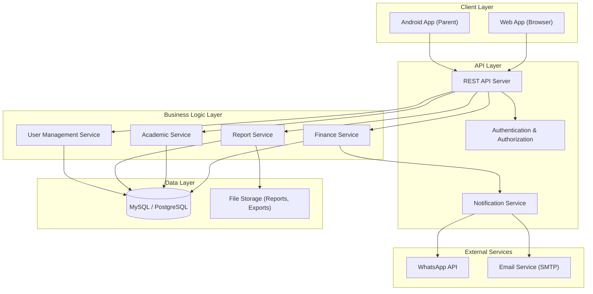

# APPSO — Product & Systems Documentation
## Finance Module & Academic Module

> This document demonstrates **Product Development** and **System Analysis** capabilities, covering system design & decomposition (PRD + SRS), API design & contracts, and requirements engineering for APPSO's two core modules.

---

# Part 1: System Design & Decomposition

## 1.1 Product Requirements Document (PRD)

### Product Overview

| Field | Detail |
|---|---|
| **Product** | APPSO — Aplikasi Sekolah Online |
| **Scope** | Finance Module & Academic Module |
| **Target Users** | Admin TU, Kepala Sekolah, Guru, Orang Tua, Siswa |
| **Platform** | Web (SaaS) + Android (Parent App) |
| **Business Model** | Subscription (Annual, tiered pricing) |

---

### Module A: Finance Module (Modul Keuangan)

#### Problem Statement
Schools in Indonesia still rely on manual bookkeeping for tuition payments (SPP), student savings, and cash flow tracking. This leads to data inaccuracies, slow reporting, lack of transparency to parents, and difficulty in financial auditing.

#### Goals & Objectives
1. Digitalize all school fee collection and payment tracking
2. Automate financial reporting (income, expense, balance)
3. Provide real-time payment notifications to parents via WhatsApp/Email
4. Enable transparent billing visibility for parents through mobile app
5. Support Excel import/export for data migration and backup

#### Feature Decomposition

```
Finance Module
├── Pembayaran SPP & Biaya Lainnya (Tuition & Fee Payment)
│   ├── Create & manage billing types (SPP, registration, building, etc.)
│   ├── Assign billing to students (individual / batch / class-wide)
│   ├── Record payments (full / partial / installment)
│   ├── Generate payment receipts
│   ├── Send WhatsApp notification on payment
│   └── Payment history & status dashboard
│
├── Tabungan Siswa (Student Savings)
│   ├── Create savings accounts per student
│   ├── Record deposits & withdrawals
│   ├── Auto-calculate running balance
│   ├── Integration with payment module (savings → pay bills)
│   └── Savings statement report
│
└── Buku Kas Sekolah (School Cash Book)
    ├── Record income transactions (categorized by source)
    ├── Record expense transactions (categorized by type)
    ├── Daily/monthly/yearly cash flow summary
    ├── Balance sheet generation
    └── Export report to Excel/PDF
```

#### User Stories

| ID | As a... | I want to... | So that... |
|---|---|---|---|
| FIN-01 | Admin TU | Record student tuition payments | Payment status is updated in real-time |
| FIN-02 | Admin TU | Create multiple billing types | Each type of school fee is tracked separately |
| FIN-03 | Admin TU | Batch-assign bills to all students in a class | I don't need to create bills one by one |
| FIN-04 | Orang Tua | View my child's billing status on the mobile app | I know which bills are paid and outstanding |
| FIN-05 | Orang Tua | Receive WhatsApp notification when a payment is recorded | I get real-time confirmation of payment |
| FIN-06 | Admin TU | Record student savings deposits and withdrawals | Savings balance is always accurate |
| FIN-07 | Admin TU | Use student savings to pay outstanding bills | Cross-module financial operations are seamless |
| FIN-08 | Kepala Sekolah | View cash flow reports by period | I can monitor school financial health |
| FIN-09 | Admin TU | Export financial reports to Excel | Data can be archived and used for auditing |
| FIN-10 | Admin TU | Import student data from Excel | Bulk data entry is fast and error-free |

---

### Module B: Academic Module (Modul Akademik)

#### Problem Statement
Teachers spend excessive time on manual attendance tracking, lesson journal writing, grade calculations, and report card generation. Different curriculum standards (K13 vs. Merdeka) add complexity to the grading and report card printing process.

#### Goals & Objectives
1. Streamline attendance tracking with digital tools
2. Enable teachers to manage lesson journals and RPP digitally
3. Automate grade computation and report card generation
4. Support both **Kurikulum K13** and **Kurikulum Merdeka** grading formats
5. Track student merit/demerit points (Angka Kredit) for behavioral evaluation

#### Feature Decomposition

```
Academic Module
├── Penjadwalan & Absensi (Scheduling & Attendance)
│   ├── Create class schedules (per semester)
│   ├── Record daily attendance (present, sick, permission, absent)
│   ├── Attendance recap (daily / weekly / monthly)
│   └── Attendance reports per student / per class
│
├── Jurnal Guru & RPP (Teacher Journal & Lesson Plan)
│   ├── Create and manage lesson plans (RPP)
│   ├── Record daily teaching journals
│   └── Journal archive per teacher per semester
│
├── Penilaian & Raport Digital (Grading & Digital Report Card)
│   ├── Input grades by subject and assessment type
│   ├── Grade computation (weighted average / competency-based)
│   ├── Support K13 grading (KI-1 to KI-4, predikat, deskripsi)
│   ├── Support Merdeka grading (Capaian Pembelajaran, narasi)
│   ├── Mid-semester report (UTS)
│   ├── End-semester report card (UAS)
│   └── Print / export report card as PDF
│
└── Angka Kredit Siswa (Student Merit/Demerit Points)
    ├── Define violation and achievement categories
    ├── Record point entries per student
    ├── Auto-calculate cumulative points
    └── Point summary report per student / per class
```

#### User Stories

| ID | As a... | I want to... | So that... |
|---|---|---|---|
| ACD-01 | Guru | Record student attendance digitally | Attendance data is centralized and accessible |
| ACD-02 | Guru | Create and save lesson plans (RPP) | My teaching plans are documented and reusable |
| ACD-03 | Guru | Input grades per subject and assessment type | Grading is organized and automated |
| ACD-04 | Wali Kelas | Generate report cards for my class | I can print/export report cards without manual work |
| ACD-05 | Wali Kelas | Choose between K13 and Merdeka format | The report card matches the school's active curriculum |
| ACD-06 | Guru BK | Record student violations and achievements | Behavioral tracking is systematic |
| ACD-07 | Kepala Sekolah | View attendance summary reports | I can monitor teaching/learning activity |
| ACD-08 | Orang Tua | View my child's grades and report card on the app | I can monitor academic performance remotely |
| ACD-09 | Guru | Fill in daily teaching journals | Teaching activities are documented per session |
| ACD-10 | Admin TU | Manage class schedules for the semester | All classes have structured timetables |

---

## 1.2 Software Requirements Specification (SRS)

### System Architecture Overview



### Functional Requirements

#### FR-FIN: Finance Module

| ID | Requirement | Priority |
|---|---|---|
| FR-FIN-01 | System shall allow admin to create, update, and delete billing types | Must Have |
| FR-FIN-02 | System shall allow batch assignment of bills to students by class | Must Have |
| FR-FIN-03 | System shall record full, partial, and installment payments | Must Have |
| FR-FIN-04 | System shall auto-calculate remaining balance per billing | Must Have |
| FR-FIN-05 | System shall generate payment receipts in PDF format | Must Have |
| FR-FIN-06 | System shall send WhatsApp notification upon payment recording | Should Have |
| FR-FIN-07 | System shall display billing status to parents via Android app | Must Have |
| FR-FIN-08 | System shall manage student savings accounts with auto-balance | Should Have |
| FR-FIN-09 | System shall allow cross-module payment (savings → billing) | Nice to Have |
| FR-FIN-10 | System shall generate income/expense reports by period | Must Have |
| FR-FIN-11 | System shall support data import from Excel template | Must Have |
| FR-FIN-12 | System shall support data export to Excel format | Must Have |

#### FR-ACD: Academic Module

| ID | Requirement | Priority |
|---|---|---|
| FR-ACD-01 | System shall allow teachers to record attendance per class session | Must Have |
| FR-ACD-02 | System shall support 4 attendance statuses: present, sick, permission, absent | Must Have |
| FR-ACD-03 | System shall allow teachers to create and store RPP documents | Should Have |
| FR-ACD-04 | System shall allow teachers to input daily teaching journals | Should Have |
| FR-ACD-05 | System shall support grade input by subject, KD, and assessment type | Must Have |
| FR-ACD-06 | System shall auto-compute final grades based on weight configuration | Must Have |
| FR-ACD-07 | System shall generate report cards in K13 format (KI-1 to KI-4, predikat) | Must Have |
| FR-ACD-08 | System shall generate report cards in Merdeka format (Capaian Pembelajaran) | Must Have |
| FR-ACD-09 | System shall export report cards as PDF | Must Have |
| FR-ACD-10 | System shall allow BK teachers to record violations and achievements | Should Have |
| FR-ACD-11 | System shall auto-calculate cumulative merit/demerit points | Should Have |
| FR-ACD-12 | System shall display grades and report cards to parents via Android app | Must Have |

### Non-Functional Requirements

| ID | Category | Requirement |
|---|---|---|
| NFR-01 | **Performance** | API response time < 500ms for 95th percentile |
| NFR-02 | **Availability** | System uptime ≥ 99.5% (24/7 online access) |
| NFR-03 | **Scalability** | Support 174+ schools with concurrent users |
| NFR-04 | **Security** | Role-based access control (RBAC) per school and user role |
| NFR-05 | **Security** | Data isolation between schools (multi-tenant) |
| NFR-06 | **Data Integrity** | Automatic periodic database backup |
| NFR-07 | **Usability** | Mobile-responsive web interface |
| NFR-08 | **Compatibility** | Android app minimum SDK 21 (Android 5.0+) |
| NFR-09 | **Localization** | Bahasa Indonesia as primary language |
| NFR-10 | **Data Portability** | Excel import/export support for all core data |

---

# Part 2: API Design & Contracts

## 2.1 API Overview

- **Base URL:** `https://api.appso.id/v1`
- **Authentication:** Bearer Token (JWT)
- **Content-Type:** `application/json`
- **Multi-tenant:** All requests scoped to `school_id` derived from authenticated user

### Common Headers

```
Authorization: Bearer <jwt_token>
Content-Type: application/json
Accept: application/json
X-School-ID: <school_uuid>
```

### Standard Response Envelope

```json
{
  "success": true,
  "message": "Operation completed successfully",
  "data": { },
  "meta": {
    "current_page": 1,
    "per_page": 20,
    "total": 150,
    "total_pages": 8
  }
}
```

### Standard Error Response

```json
{
  "success": false,
  "message": "Validation failed",
  "errors": {
    "field_name": ["Error description"]
  },
  "error_code": "VALIDATION_ERROR"
}
```

### Error Codes

| HTTP Code | Error Code | Description |
|---|---|---|
| 400 | `VALIDATION_ERROR` | Request body failed validation |
| 401 | `UNAUTHORIZED` | Missing or invalid JWT token |
| 403 | `FORBIDDEN` | User lacks permission for this action |
| 404 | `NOT_FOUND` | Resource not found in this school scope |
| 409 | `CONFLICT` | Duplicate or conflicting data (e.g., double payment) |
| 422 | `BUSINESS_RULE_VIOLATION` | Action violates business logic (e.g., insufficient savings) |
| 429 | `RATE_LIMITED` | Too many requests |
| 500 | `INTERNAL_ERROR` | Unexpected server error |

---

## 2.2 Finance Module APIs

### Billing Types

#### `POST /finance/billing-types` — Create Billing Type

**Request:**
```json
{
  "name": "SPP Bulanan",
  "category": "tuition",
  "amount": 350000,
  "billing_cycle": "monthly",
  "academic_year": "2025/2026",
  "description": "Sumbangan Pembinaan Pendidikan per bulan"
}
```

**Response (201 Created):**
```json
{
  "success": true,
  "message": "Billing type created",
  "data": {
    "id": "bt_abc123",
    "name": "SPP Bulanan",
    "category": "tuition",
    "amount": 350000,
    "billing_cycle": "monthly",
    "academic_year": "2025/2026",
    "description": "Sumbangan Pembinaan Pendidikan per bulan",
    "created_at": "2026-02-26T08:00:00Z"
  }
}
```

#### `GET /finance/billing-types` — List Billing Types

**Query Parameters:**
| Param | Type | Required | Description |
|---|---|---|---|
| `academic_year` | string | No | Filter by academic year |
| `category` | string | No | Filter: `tuition`, `registration`, `building`, `other` |
| `page` | int | No | Page number (default: 1) |
| `per_page` | int | No | Items per page (default: 20, max: 100) |

---

### Student Billings

#### `POST /finance/billings/batch` — Batch Assign Billings to Students

**Request:**
```json
{
  "billing_type_id": "bt_abc123",
  "assignment_type": "class",
  "class_id": "cls_def456",
  "billing_months": ["2026-01", "2026-02", "2026-03"],
  "due_date_offset_days": 10
}
```

**Response (201 Created):**
```json
{
  "success": true,
  "message": "Billings assigned to 32 students",
  "data": {
    "total_students": 32,
    "total_billings_created": 96,
    "billing_type": "SPP Bulanan",
    "class": "Kelas 7A"
  }
}
```

**Error (409 Conflict):**
```json
{
  "success": false,
  "message": "Some billings already exist for the selected period",
  "error_code": "CONFLICT",
  "errors": {
    "duplicates": [
      { "student_id": "std_001", "month": "2026-01", "existing_billing_id": "bil_xyz" }
    ]
  }
}
```

---

### Payments

#### `POST /finance/payments` — Record Payment

**Request:**
```json
{
  "billing_id": "bil_xyz789",
  "student_id": "std_001",
  "amount_paid": 350000,
  "payment_method": "cash",
  "payment_date": "2026-02-25",
  "notes": "Pembayaran SPP Februari 2026",
  "send_notification": true
}
```

**Response (201 Created):**
```json
{
  "success": true,
  "message": "Payment recorded and notification sent",
  "data": {
    "payment_id": "pay_mnop456",
    "billing_id": "bil_xyz789",
    "student_id": "std_001",
    "student_name": "Ahmad Fauzi",
    "amount_paid": 350000,
    "remaining_balance": 0,
    "payment_status": "paid",
    "payment_method": "cash",
    "receipt_url": "/finance/payments/pay_mnop456/receipt",
    "notification_sent": true,
    "payment_date": "2026-02-25",
    "recorded_at": "2026-02-25T09:30:00Z"
  }
}
```

**Error (422 Business Rule Violation):**
```json
{
  "success": false,
  "message": "Payment amount exceeds remaining balance",
  "error_code": "BUSINESS_RULE_VIOLATION",
  "errors": {
    "amount_paid": ["Amount Rp 500.000 exceeds remaining balance Rp 350.000"]
  }
}
```

#### `GET /finance/payments` — List Payments

**Query Parameters:**
| Param | Type | Required | Description |
|---|---|---|---|
| `student_id` | string | No | Filter by student |
| `billing_type_id` | string | No | Filter by billing type |
| `payment_status` | string | No | `paid`, `partial`, `unpaid` |
| `date_from` | date | No | Start date filter |
| `date_to` | date | No | End date filter |
| `page` | int | No | Page number |

---

### Student Savings

#### `POST /finance/savings/transactions` — Record Savings Transaction

**Request:**
```json
{
  "student_id": "std_001",
  "transaction_type": "deposit",
  "amount": 50000,
  "description": "Setoran tabungan mingguan",
  "transaction_date": "2026-02-25"
}
```

**Response (201 Created):**
```json
{
  "success": true,
  "message": "Deposit recorded",
  "data": {
    "transaction_id": "sav_tx_001",
    "student_id": "std_001",
    "student_name": "Ahmad Fauzi",
    "transaction_type": "deposit",
    "amount": 50000,
    "running_balance": 750000,
    "description": "Setoran tabungan mingguan",
    "transaction_date": "2026-02-25"
  }
}
```

#### `POST /finance/savings/pay-billing` — Pay Billing from Savings

**Request:**
```json
{
  "student_id": "std_001",
  "billing_id": "bil_xyz789",
  "amount": 350000
}
```

**Error (422 Business Rule Violation):**
```json
{
  "success": false,
  "message": "Insufficient savings balance",
  "error_code": "BUSINESS_RULE_VIOLATION",
  "errors": {
    "amount": ["Savings balance Rp 200.000 is less than requested amount Rp 350.000"]
  }
}
```

---

### Cash Book

#### `POST /finance/cashbook/entries` — Create Cash Book Entry

**Request:**
```json
{
  "entry_type": "income",
  "category": "spp_payment",
  "amount": 11200000,
  "description": "Total penerimaan SPP Februari 2026 - Kelas 7",
  "entry_date": "2026-02-28",
  "reference_id": "batch_pay_feb_k7"
}
```

**Response (201 Created):**
```json
{
  "success": true,
  "data": {
    "entry_id": "cb_001",
    "entry_type": "income",
    "category": "spp_payment",
    "amount": 11200000,
    "running_balance": 45600000,
    "entry_date": "2026-02-28"
  }
}
```

#### `GET /finance/cashbook/summary` — Cash Flow Summary

**Query Parameters:** `period` (`daily`, `monthly`, `yearly`), `date_from`, `date_to`

**Response:**
```json
{
  "success": true,
  "data": {
    "period": "monthly",
    "date_from": "2026-02-01",
    "date_to": "2026-02-28",
    "total_income": 45600000,
    "total_expense": 12300000,
    "net_balance": 33300000,
    "breakdown": {
      "income_by_category": [
        { "category": "spp_payment", "total": 38400000 },
        { "category": "registration_fee", "total": 7200000 }
      ],
      "expense_by_category": [
        { "category": "operational", "total": 8500000 },
        { "category": "maintenance", "total": 3800000 }
      ]
    }
  }
}
```

---

## 2.3 Academic Module APIs

### Attendance

#### `POST /academic/attendance` — Record Class Attendance

**Request:**
```json
{
  "class_id": "cls_def456",
  "subject_id": "sub_math01",
  "session_date": "2026-02-25",
  "session_number": 1,
  "records": [
    { "student_id": "std_001", "status": "present" },
    { "student_id": "std_002", "status": "sick", "notes": "Demam" },
    { "student_id": "std_003", "status": "absent" },
    { "student_id": "std_004", "status": "permission", "notes": "Acara keluarga" }
  ]
}
```

**Response (201 Created):**
```json
{
  "success": true,
  "message": "Attendance recorded for 32 students",
  "data": {
    "attendance_id": "att_abc001",
    "class": "Kelas 7A",
    "subject": "Matematika",
    "session_date": "2026-02-25",
    "summary": {
      "present": 29,
      "sick": 1,
      "permission": 1,
      "absent": 1,
      "total": 32
    }
  }
}
```

#### `GET /academic/attendance/recap` — Attendance Recap Report

**Query Parameters:** `class_id`, `student_id`, `period` (`weekly`, `monthly`, `semester`), `date_from`, `date_to`

**Response:**
```json
{
  "success": true,
  "data": {
    "student_id": "std_001",
    "student_name": "Ahmad Fauzi",
    "period": "monthly",
    "month": "2026-02",
    "summary": {
      "total_sessions": 24,
      "present": 22,
      "sick": 1,
      "permission": 1,
      "absent": 0,
      "attendance_rate": 91.67
    }
  }
}
```

---

### Grades

#### `POST /academic/grades` — Input Student Grades

**Request:**
```json
{
  "class_id": "cls_def456",
  "subject_id": "sub_math01",
  "assessment_type": "daily_test",
  "assessment_name": "Ulangan Harian Bab 3",
  "academic_year": "2025/2026",
  "semester": 2,
  "grades": [
    { "student_id": "std_001", "score": 85 },
    { "student_id": "std_002", "score": 72 },
    { "student_id": "std_003", "score": 90 }
  ]
}
```

**Response (201 Created):**
```json
{
  "success": true,
  "message": "Grades recorded for 32 students",
  "data": {
    "grade_batch_id": "gb_001",
    "subject": "Matematika",
    "assessment_type": "daily_test",
    "assessment_name": "Ulangan Harian Bab 3",
    "stats": {
      "count": 32,
      "average": 78.5,
      "highest": 98,
      "lowest": 45,
      "above_kkm": 28,
      "below_kkm": 4
    }
  }
}
```

---

### Report Cards

#### `POST /academic/report-cards/generate` — Generate Report Cards

**Request:**
```json
{
  "class_id": "cls_def456",
  "academic_year": "2025/2026",
  "semester": 2,
  "curriculum": "merdeka",
  "include_attendance": true,
  "include_extracurricular": true,
  "include_merit_points": true
}
```

**Response (202 Accepted):**
```json
{
  "success": true,
  "message": "Report card generation queued for 32 students",
  "data": {
    "job_id": "rc_job_001",
    "status": "processing",
    "class": "Kelas 7A",
    "curriculum": "merdeka",
    "total_students": 32,
    "estimated_completion": "2026-02-25T10:05:00Z",
    "check_status_url": "/academic/report-cards/jobs/rc_job_001"
  }
}
```

#### `GET /academic/report-cards/{student_id}` — Get Student Report Card

**Response:**
```json
{
  "success": true,
  "data": {
    "student_id": "std_001",
    "student_name": "Ahmad Fauzi",
    "class": "Kelas 7A",
    "academic_year": "2025/2026",
    "semester": 2,
    "curriculum": "merdeka",
    "subjects": [
      {
        "subject": "Matematika",
        "capaian_pembelajaran": "Menunjukkan pemahaman yang baik...",
        "score": 85,
        "grade": "A",
        "teacher_notes": "Perlu peningkatan di geometri"
      }
    ],
    "attendance_summary": {
      "present": 112, "sick": 3, "permission": 2, "absent": 1
    },
    "extracurricular": [
      { "name": "Pramuka", "grade": "Baik" }
    ],
    "merit_points": { "achievements": 15, "violations": 2, "net": 13 },
    "homeroom_notes": "Ahmad menunjukkan perkembangan yang baik...",
    "principal_signature": true,
    "pdf_url": "/academic/report-cards/std_001/download"
  }
}
```

---

### Merit/Demerit Points

#### `POST /academic/merit-points` — Record Merit/Demerit Entry

**Request:**
```json
{
  "student_id": "std_003",
  "entry_type": "violation",
  "category": "tardiness",
  "points": 5,
  "description": "Terlambat masuk kelas 15 menit",
  "recorded_by": "teacher_bk_001",
  "incident_date": "2026-02-25"
}
```

**Response (201 Created):**
```json
{
  "success": true,
  "data": {
    "entry_id": "mp_001",
    "student_name": "Siti Aminah",
    "entry_type": "violation",
    "category": "tardiness",
    "points": 5,
    "cumulative_violations": 12,
    "cumulative_achievements": 20,
    "net_points": 8,
    "incident_date": "2026-02-25"
  }
}
```

---

# Part 3: Requirements Engineering

## 3.1 Finance Module — Requirements & Acceptance Criteria

### REQ-FIN-01: Billing Type Management

| Field | Detail |
|---|---|
| **Requirement** | Admin can create, view, update, and delete billing types |
| **Priority** | Must Have |
| **Dependency** | User authentication, school context |

**Acceptance Criteria:**
- [ ] AC-01: Admin can create a billing type with name, category, amount, cycle, and academic year
- [ ] AC-02: System prevents duplicate billing type names within the same academic year
- [ ] AC-03: Admin can update billing type details; changes do not affect already-generated bills
- [ ] AC-04: Admin can soft-delete a billing type; existing bills remain unaffected
- [ ] AC-05: Billing type list supports pagination, search by name, and filter by category

---

### REQ-FIN-02: Batch Billing Assignment

| Field | Detail |
|---|---|
| **Requirement** | Admin can assign billings to all students in a class at once |
| **Priority** | Must Have |
| **Dependency** | REQ-FIN-01, Student & Class data |

**Acceptance Criteria:**
- [ ] AC-01: Admin can select a billing type and target class to generate bills
- [ ] AC-02: System generates individual billing records for each active student in the class
- [ ] AC-03: System detects and prevents duplicate billing for the same student and period
- [ ] AC-04: Inactive or transferred students are excluded from batch assignment
- [ ] AC-05: System displays summary of total billings created after batch operation

---

### REQ-FIN-03: Payment Recording

| Field | Detail |
|---|---|
| **Requirement** | Admin can record full, partial, or installment payments |
| **Priority** | Must Have |
| **Dependency** | REQ-FIN-02 |

**Acceptance Criteria:**
- [ ] AC-01: Admin can record a payment with amount, method, and date
- [ ] AC-02: System auto-calculates remaining balance after partial payment
- [ ] AC-03: System prevents payment amount exceeding remaining balance
- [ ] AC-04: System updates billing status: `unpaid` → `partial` → `paid`
- [ ] AC-05: System generates a printable payment receipt (PDF)
- [ ] AC-06: WhatsApp notification is sent to parent (if enabled) within 30 seconds

---

### REQ-FIN-04: Student Savings Management

| Field | Detail |
|---|---|
| **Requirement** | Admin can manage student savings accounts with deposits and withdrawals |
| **Priority** | Should Have |
| **Dependency** | Student data |

**Acceptance Criteria:**
- [ ] AC-01: Each student has a savings account with running balance
- [ ] AC-02: Admin can record deposit with amount, description, and date
- [ ] AC-03: Admin can record withdrawal; system prevents withdrawal exceeding balance
- [ ] AC-04: Running balance is auto-calculated after each transaction
- [ ] AC-05: Savings statement report is exportable to Excel/PDF

---

### REQ-FIN-05: Cross-Module Payment (Savings → Billing)

| Field | Detail |
|---|---|
| **Requirement** | Admin can pay a student's bill using their savings balance |
| **Priority** | Nice to Have |
| **Dependency** | REQ-FIN-03, REQ-FIN-04 |

**Acceptance Criteria:**
- [ ] AC-01: Admin can select a billing and pay from savings in a single-action
- [ ] AC-02: System validates sufficient savings balance before processing
- [ ] AC-03: Both savings withdrawal and payment recording happen atomically (transaction)
- [ ] AC-04: If transaction fails, neither savings nor billing is modified (rollback)
- [ ] AC-05: Both savings and payment history reflect the cross-module transaction

---

### REQ-FIN-06: Cash Book & Financial Reporting

| Field | Detail |
|---|---|
| **Requirement** | Admin can record income/expenses and generate financial reports |
| **Priority** | Must Have |
| **Dependency** | REQ-FIN-03 |

**Acceptance Criteria:**
- [ ] AC-01: Admin can record income entries with category, amount, date, and description
- [ ] AC-02: Admin can record expense entries with category, amount, date, and description
- [ ] AC-03: System auto-calculates daily, monthly, and yearly cash flow balance
- [ ] AC-04: Reports include breakdown by income/expense category
- [ ] AC-05: Reports are exportable to Excel and PDF
- [ ] AC-06: Kepala Sekolah can view reports (read-only access via dashboard)

---

### REQ-FIN-07: Data Import & Export

| Field | Detail |
|---|---|
| **Requirement** | Admin can import student data from Excel and export financial reports |
| **Priority** | Must Have |
| **Dependency** | Student data, Finance data |

**Acceptance Criteria:**
- [ ] AC-01: System provides downloadable Excel template for data import
- [ ] AC-02: System validates imported data and shows errors before committing
- [ ] AC-03: Import supports student master data and initial billing data
- [ ] AC-04: Export includes all financial transactions with filters applied
- [ ] AC-05: Large exports (1000+ rows) are processed asynchronously with download link

---

## 3.2 Academic Module — Requirements & Acceptance Criteria

### REQ-ACD-01: Scheduling & Attendance

| Field | Detail |
|---|---|
| **Requirement** | Teachers can record and manage class attendance digitally |
| **Priority** | Must Have |
| **Dependency** | Class schedule, Student data |

**Acceptance Criteria:**
- [ ] AC-01: Admin can create class schedules with subjects, teachers, and time slots
- [ ] AC-02: Teacher sees their daily schedule and can open attendance form per session
- [ ] AC-03: Teacher records status for each student: present, sick, permission, or absent
- [ ] AC-04: System generates attendance recap per student, class, or period
- [ ] AC-05: Attendance data is available to parents via the mobile app
- [ ] AC-06: Attendance rate is calculated and shown as percentage

---

### REQ-ACD-02: Teacher Journal & Lesson Plan (RPP)

| Field | Detail |
|---|---|
| **Requirement** | Teachers can create lesson plans and log daily teaching journals |
| **Priority** | Should Have |
| **Dependency** | Class schedule, Subject data |

**Acceptance Criteria:**
- [ ] AC-01: Teacher can create RPP with title, objectives, material, and activities
- [ ] AC-02: RPP is linked to subject and class
- [ ] AC-03: Teacher can fill daily journal with teaching summary per session
- [ ] AC-04: Journals are archived and searchable by date and subject
- [ ] AC-05: Kepala Sekolah can view teacher journals for monitoring purposes

---

### REQ-ACD-03: Grade Input & Computation

| Field | Detail |
|---|---|
| **Requirement** | Teachers can input grades and system auto-computes final scores |
| **Priority** | Must Have |
| **Dependency** | Student & Class data, Subject data |

**Acceptance Criteria:**
- [ ] AC-01: Teacher selects class and subject to open grade input form
- [ ] AC-02: System supports multiple assessment types: UH, UTS, UAS, tugas, praktik
- [ ] AC-03: Admin can configure grade weight per assessment type per subject
- [ ] AC-04: System auto-computes weighted average for final grade
- [ ] AC-05: System flags students below KKM (Kriteria Ketuntasan Minimal)
- [ ] AC-06: Grade batch statistics (avg, min, max, above/below KKM) are shown

---

### REQ-ACD-04: Report Card Generation (K13 & Merdeka)

| Field | Detail |
|---|---|
| **Requirement** | System generates digital report cards supporting both K13 and Merdeka curriculum |
| **Priority** | Must Have |
| **Dependency** | REQ-ACD-03, REQ-ACD-01 |

**Acceptance Criteria:**
- [ ] AC-01: School admin can set the active curriculum (K13 or Merdeka) per class/level
- [ ] AC-02: **K13 format**: Report card shows KI-1 to KI-4 scores, predikat, and description
- [ ] AC-03: **Merdeka format**: Report card shows Capaian Pembelajaran with narrative assessment
- [ ] AC-04: Report card includes attendance summary, extracurricular, and homeroom notes
- [ ] AC-05: Homeroom teacher can add individual notes per student
- [ ] AC-06: Report cards can be generated in batch (entire class) or individually
- [ ] AC-07: Report cards are exportable/printable as PDF
- [ ] AC-08: Parents can view report cards via the Android app

---

### REQ-ACD-05: Student Merit/Demerit Point System

| Field | Detail |
|---|---|
| **Requirement** | BK teacher can record and track student behavioral points |
| **Priority** | Should Have |
| **Dependency** | Student data |

**Acceptance Criteria:**
- [ ] AC-01: Admin defines violation and achievement categories with default point values
- [ ] AC-02: BK teacher records entries with category, points, description, and date
- [ ] AC-03: System auto-calculates cumulative achievement and violation points
- [ ] AC-04: Net merit score (achievements - violations) is computed per student
- [ ] AC-05: Point summary report is available per student and per class
- [ ] AC-06: Merit points are included in the report card if enabled

---

### REQ-ACD-06: Parent Academic Access

| Field | Detail |
|---|---|
| **Requirement** | Parents can view their child's academic information via the Android app |
| **Priority** | Must Have |
| **Dependency** | All Academic sub-modules |

**Acceptance Criteria:**
- [ ] AC-01: Parent can view attendance history and summary
- [ ] AC-02: Parent can view grades per subject and assessment
- [ ] AC-03: Parent can view and download report cards as PDF
- [ ] AC-04: Parent can view merit/demerit point summary
- [ ] AC-05: Data access is restricted to the parent's linked child only
- [ ] AC-06: Data refreshes within 5 minutes of teacher input

---

## Summary Matrix

| Module | Requirements | User Stories | API Endpoints | Acceptance Criteria |
|---|:---:|:---:|:---:|:---:|
| **Finance** | 7 | 10 | 9 | 37 |
| **Academic** | 6 | 10 | 7 | 35 |
| **Total** | **13** | **20** | **16** | **72** |
