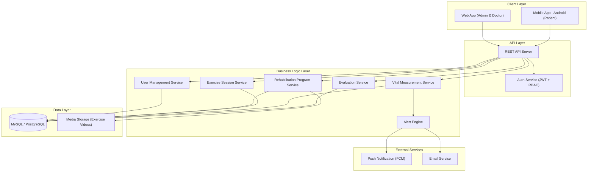
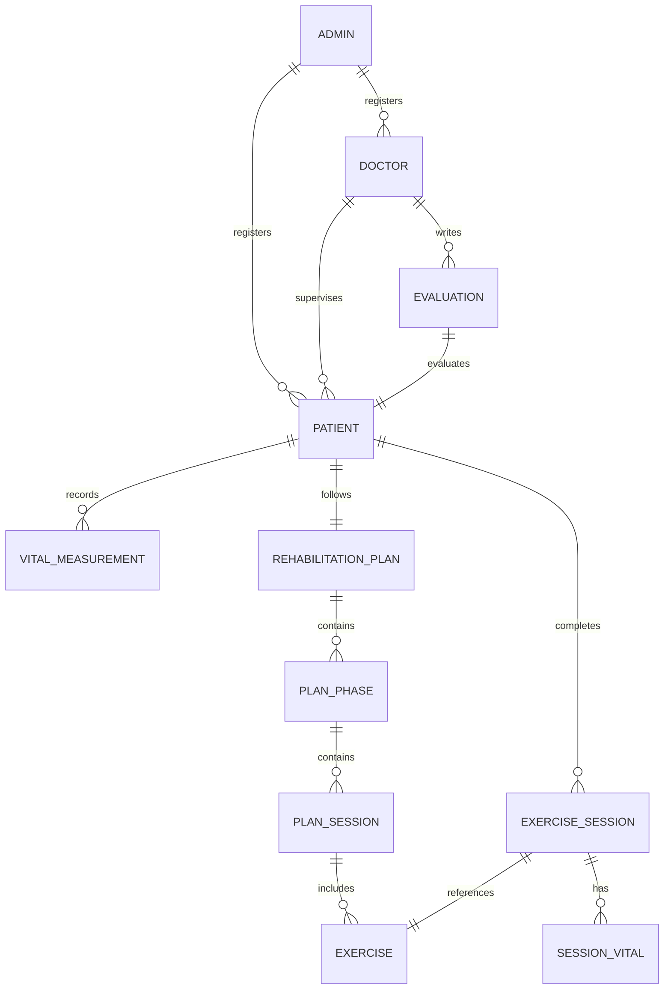

# CofitRehab — Product & Systems Documentation
## COVID-19 Rehabilitation Application

> This document demonstrates **Product Development** and **System Analysis** capabilities, covering system design & decomposition (PRD + SRS), API design & contracts, and requirements engineering for CofitRehab.

---

# Part 1: System Design & Decomposition

## 1.1 Product Requirements Document (PRD)

### Product Overview

| Field | Detail |
|---|---|
| **Product** | CofitRehab — COVID-19 Rehabilitation App |
| **Domain** | Health-tech / Pulmonary Rehabilitation |
| **Target Users** | COVID-19 survivors, Doctors, Admin |
| **Platforms** | Web App (Admin & Doctor) + Mobile App (Patient, Android) |
| **Architecture** | Multi-role system with RBAC |

### Roles & Platform Matrix

| Role | Platform | Access Level |
|---|---|---|
| Admin CofitRehab | Web App | Full system management — doctors, patients, programs |
| Doctor | Web App | Read patient data, write evaluations |
| Patient | Mobile App | Execute exercises, input measurements, view progress |

---

### Module A: User & Program Management (Admin)

#### Problem Statement
Managing rehabilitation participants and programs manually is error-prone and unscalable. Admin needs a centralized system to register doctors/patients, assign supervision relationships, and maintain the rehabilitation program catalog.

#### Goals & Objectives
1. Centralized registration of doctors and patients
2. Flexible patient-to-doctor assignment
3. Rehabilitation program catalog management (exercises, phases, schedules)
4. System-wide monitoring and reporting

#### Feature Decomposition

```
Admin Module
├── Doctor Management
│   ├── Register doctor (name, specialization, license number, email)
│   ├── Update doctor profile
│   ├── Activate / deactivate doctor accounts
│   └── View doctor workload (assigned patients count)
│
├── Patient Management
│   ├── Register patient (demographics, medical history, severity level)
│   ├── Assign patient to a doctor
│   ├── Reassign patient to different doctor
│   ├── Set patient rehabilitation phase (Phase 1/2/3)
│   └── View patient list with status & progress summary
│
├── Rehabilitation Program Catalog
│   ├── Define exercise categories (pulmonary, aerobic, strengthening)
│   ├── Create exercise entries (name, description, video URL, duration, reps)
│   ├── Build rehabilitation plans (phase → sessions → exercises)
│   └── Assign plans to patients (individually or by severity level)
│
└── Dashboard & Reports
    ├── Total active doctors and patients
    ├── Patient adherence overview
    └── System usage statistics
```

#### User Stories

| ID | As a... | I want to... | So that... |
|---|---|---|---|
| ADM-01 | Admin | Register a new doctor with credentials | The doctor can log in and review patients |
| ADM-02 | Admin | Register a new patient with medical profile | The patient is ready to be assigned and start rehab |
| ADM-03 | Admin | Assign a patient to a doctor | The doctor is responsible for monitoring that patient |
| ADM-04 | Admin | Reassign a patient to a different doctor | Patient supervision can transfer when needed |
| ADM-05 | Admin | Create and manage exercise entries | The exercise catalog stays current |
| ADM-06 | Admin | Build a rehabilitation plan with phases and sessions | Patients receive structured rehab programs |
| ADM-07 | Admin | View system-wide dashboard | I can monitor overall platform usage |

---

### Module B: Guided Rehabilitation & Health Measurement (Patient — Mobile)

#### Problem Statement
Patients recovering from COVID-19 at home lack structured rehabilitation guidance and tools to track their vital signs. Without proper tracking, patients risk overexertion, skip sessions, or fail to notice deteriorating health indicators.

#### Goals & Objectives
1. Deliver step-by-step guided rehabilitation exercises on mobile
2. Enable patients to record daily vital measurements (SpO2, HR, etc.)
3. Provide exercise scheduling with reminders
4. Track session completion and rehabilitation adherence
5. Visualize health trends for patient self-awareness

#### Feature Decomposition

```
Patient Module (Mobile App)
├── Guided Exercise
│   ├── View today's rehabilitation schedule
│   ├── Start exercise session (video/instruction + timer)
│   ├── Follow step-by-step exercise with rep/set counter
│   ├── Record pre-exercise vitals (SpO2, heart rate)
│   ├── Record post-exercise vitals
│   ├── Mark session as completed
│   └── View exercise history (past sessions)
│
├── Health Measurement
│   ├── Input daily vitals: SpO2, Heart Rate, Respiratory Rate, Temperature
│   ├── Input subjective assessment (Borg Scale: 0-10 perceived exertion)
│   ├── Input breathlessness scale (mMRC: 0-4)
│   ├── View measurement history
│   └── View trend charts (SpO2 & HR over time)
│
├── Progress Dashboard
│   ├── Current rehabilitation phase indicator
│   ├── Weekly session completion rate
│   ├── Vital sign trend summary
│   └── Doctor evaluation notifications
│
└── Notifications & Reminders
    ├── Daily exercise reminder (push notification)
    ├── Measurement input reminder
    └── Doctor evaluation received notification
```

#### User Stories

| ID | As a... | I want to... | So that... |
|---|---|---|---|
| PAT-01 | Patient | See today's scheduled exercises | I know what rehabilitation to do today |
| PAT-02 | Patient | Follow video-guided exercises with timer | I perform exercises correctly and safely |
| PAT-03 | Patient | Record my SpO2 before and after exercise | I can monitor my oxygen levels |
| PAT-04 | Patient | Input daily vital signs | My doctor can see my health trends |
| PAT-05 | Patient | Rate my perceived exertion (Borg Scale) | My doctor knows how I feel during exercises |
| PAT-06 | Patient | View my SpO2 and heart rate trends | I can see my recovery progress |
| PAT-07 | Patient | See my weekly adherence rate | I stay motivated to complete sessions |
| PAT-08 | Patient | Receive daily exercise reminders | I don't forget my rehabilitation schedule |
| PAT-09 | Patient | Read my doctor's evaluation notes | I understand my doctor's feedback |
| PAT-10 | Patient | View my complete exercise history | I can track what I've completed |

---

### Module C: Patient Review & Evaluation (Doctor — Web)

#### Problem Statement
Doctors cannot effectively monitor multiple rehabilitation patients remotely. They need a dashboard to review patient activity, vital sign trends, and a mechanism to provide clinical evaluations without in-person visits.

#### Goals & Objectives
1. Provide doctors with a comprehensive patient monitoring dashboard
2. Display patient vital sign data with trend analysis
3. Enable asynchronous clinical evaluations and recommendations
4. Alert doctors to patients with concerning health indicators
5. Allow doctors to adjust rehabilitation intensity per patient

#### Feature Decomposition

```
Doctor Module (Web App)
├── Patient Dashboard
│   ├── List assigned patients with status overview
│   ├── Patient detail: profile, severity, current phase
│   ├── Exercise adherence rate per patient
│   └── Alert indicators (low SpO2, missed sessions, etc.)
│
├── Activity Review
│   ├── View patient exercise sessions (completed, skipped)
│   ├── View pre/post exercise vitals per session
│   ├── View daily vital sign history
│   └── Vital sign trend charts (SpO2, HR, respiratory rate)
│
├── Evaluation & Feedback
│   ├── Write evaluation notes per patient
│   ├── Rate patient progress (improving, stable, declining)
│   ├── Recommend program adjustments (increase/decrease intensity)
│   ├── Flag patient for urgent follow-up
│   └── Evaluation history per patient
│
└── Program Adjustment
    ├── View current patient rehabilitation plan
    ├── Change patient phase (Phase 1 → 2 → 3)
    ├── Modify exercise frequency/duration for a patient
    └── Add/remove specific exercises from patient plan
```

#### User Stories

| ID | As a... | I want to... | So that... |
|---|---|---|---|
| DOC-01 | Doctor | See all my assigned patients with status | I have an overview of my patient load |
| DOC-02 | Doctor | View a patient's exercise completion history | I know if they're following the program |
| DOC-03 | Doctor | View a patient's SpO2 trend over the past week | I can assess respiratory recovery |
| DOC-04 | Doctor | See alerts for patients with low SpO2 (<92%) | I can intervene quickly for at-risk patients |
| DOC-05 | Doctor | Write an evaluation for a patient | The patient receives my clinical feedback |
| DOC-06 | Doctor | Rate a patient's progress status | Progress is formally documented |
| DOC-07 | Doctor | Adjust a patient's rehabilitation phase | The program difficulty matches their recovery |
| DOC-08 | Doctor | Flag a patient for urgent follow-up | Critical cases are escalated appropriately |
| DOC-09 | Doctor | View a patient's Borg Scale and mMRC trends | I understand their subjective symptom experience |
| DOC-10 | Doctor | View my evaluation history for a patient | I can track my past recommendations |

---

## 1.2 Software Requirements Specification (SRS)

### System Architecture Overview



### Entity Relationship Summary



### Functional Requirements

#### FR-ADM: Admin Module

| ID | Requirement | Priority |
|---|---|---|
| FR-ADM-01 | System shall allow admin to register doctors with name, specialization, license, and email | Must Have |
| FR-ADM-02 | System shall allow admin to register patients with demographics, medical history, and severity level | Must Have |
| FR-ADM-03 | System shall allow admin to assign a patient to a doctor | Must Have |
| FR-ADM-04 | System shall allow admin to reassign a patient to a different doctor | Should Have |
| FR-ADM-05 | System shall allow admin to manage exercise catalog (CRUD) | Must Have |
| FR-ADM-06 | System shall allow admin to build rehabilitation plans with phases, sessions, and exercises | Must Have |
| FR-ADM-07 | System shall allow admin to assign rehabilitation plans to patients | Must Have |
| FR-ADM-08 | System shall display admin dashboard with system-wide statistics | Should Have |

#### FR-PAT: Patient Module (Mobile)

| ID | Requirement | Priority |
|---|---|---|
| FR-PAT-01 | System shall display today's scheduled exercises with details and video | Must Have |
| FR-PAT-02 | System shall provide step-by-step guided exercise with timer and rep counter | Must Have |
| FR-PAT-03 | System shall allow patient to record pre/post exercise vital signs | Must Have |
| FR-PAT-04 | System shall allow patient to input daily vitals (SpO2, HR, RR, temperature) | Must Have |
| FR-PAT-05 | System shall allow patient to input Borg Scale (0-10) and mMRC (0-4) | Should Have |
| FR-PAT-06 | System shall mark exercise sessions as completed with timestamp | Must Have |
| FR-PAT-07 | System shall display vital sign trend charts (line graph over time) | Must Have |
| FR-PAT-08 | System shall show weekly adherence rate (completed / scheduled sessions) | Should Have |
| FR-PAT-09 | System shall send push notifications for exercise and measurement reminders | Should Have |
| FR-PAT-10 | System shall allow patient to read doctor evaluations | Must Have |

#### FR-DOC: Doctor Module (Web)

| ID | Requirement | Priority |
|---|---|---|
| FR-DOC-01 | System shall display list of assigned patients with status overview | Must Have |
| FR-DOC-02 | System shall display patient exercise session history with completion status | Must Have |
| FR-DOC-03 | System shall display patient vital sign trends as time-series charts | Must Have |
| FR-DOC-04 | System shall alert doctor when patient SpO2 drops below 92% | Must Have |
| FR-DOC-05 | System shall alert doctor when patient misses 3+ consecutive sessions | Should Have |
| FR-DOC-06 | System shall allow doctor to write evaluation notes per patient | Must Have |
| FR-DOC-07 | System shall allow doctor to rate patient progress (improving/stable/declining) | Must Have |
| FR-DOC-08 | System shall allow doctor to adjust patient rehabilitation phase | Should Have |
| FR-DOC-09 | System shall allow doctor to modify patient exercise plan | Nice to Have |
| FR-DOC-10 | System shall allow doctor to flag a patient for urgent follow-up | Must Have |

### Non-Functional Requirements

| ID | Category | Requirement |
|---|---|---|
| NFR-01 | **Performance** | API response time < 500ms for 95th percentile |
| NFR-02 | **Availability** | System uptime ≥ 99.0% |
| NFR-03 | **Security** | RBAC — patients cannot access other patients' data |
| NFR-04 | **Security** | All data in transit encrypted via HTTPS/TLS |
| NFR-05 | **Security** | Health data stored with encryption at rest (HIPAA-adjacent compliance) |
| NFR-06 | **Usability** | Mobile app optimized for elderly/recovering users (large fonts, simple navigation) |
| NFR-07 | **Compatibility** | Android app minimum SDK 21 (Android 5.0+) |
| NFR-08 | **Scalability** | Support 500+ concurrent patients with real-time data sync |
| NFR-09 | **Data Integrity** | Vital measurements are immutable once recorded (append-only) |
| NFR-10 | **Offline** | Mobile app caches today's exercises for offline access |
| NFR-11 | **Video** | Exercise videos stream with adaptive quality based on connection |
| NFR-12 | **Notification** | Push notifications delivered within 60 seconds of trigger |

---

# Part 2: API Design & Contracts

## 2.1 API Overview

- **Base URL:** `https://api.cofitrehab.id/v1`
- **Authentication:** Bearer Token (JWT) with role claims
- **Content-Type:** `application/json`
- **Roles in Token:** `admin`, `doctor`, `patient`

### Common Headers

```
Authorization: Bearer <jwt_token>
Content-Type: application/json
Accept: application/json
```

### Standard Response Envelope

```json
{
  "success": true,
  "message": "Operation completed successfully",
  "data": { },
  "meta": {
    "current_page": 1,
    "per_page": 20,
    "total": 50,
    "total_pages": 3
  }
}
```

### Standard Error Response

```json
{
  "success": false,
  "message": "Validation failed",
  "errors": {
    "field_name": ["Error description"]
  },
  "error_code": "VALIDATION_ERROR"
}
```

### Error Codes

| HTTP Code | Error Code | Description |
|---|---|---|
| 400 | `VALIDATION_ERROR` | Request body failed validation |
| 401 | `UNAUTHORIZED` | Missing or invalid JWT token |
| 403 | `FORBIDDEN` | Role lacks permission for this resource |
| 404 | `NOT_FOUND` | Resource does not exist |
| 409 | `CONFLICT` | Duplicate entry (e.g., patient already assigned) |
| 422 | `BUSINESS_RULE_VIOLATION` | Action violates clinical/business rules |
| 429 | `RATE_LIMITED` | Too many requests |
| 500 | `INTERNAL_ERROR` | Unexpected server error |

---

## 2.2 Authentication API

### `POST /auth/login` — Login

**Request:**
```json
{
  "email": "dr.sarah@cofitrehab.id",
  "password": "securePassword123",
  "role": "doctor"
}
```

**Response (200 OK):**
```json
{
  "success": true,
  "data": {
    "token": "eyJhbGciOiJIUzI1NiIs...",
    "token_type": "Bearer",
    "expires_in": 86400,
    "user": {
      "id": "usr_doc_001",
      "name": "Dr. Sarah Wijaya",
      "email": "dr.sarah@cofitrehab.id",
      "role": "doctor",
      "specialization": "Pulmonologist"
    }
  }
}
```

**Error (401 Unauthorized):**
```json
{
  "success": false,
  "message": "Invalid email or password",
  "error_code": "UNAUTHORIZED"
}
```

---

## 2.3 Admin APIs

### Doctor Management

#### `POST /admin/doctors` — Register Doctor

**Request:**
```json
{
  "name": "Dr. Sarah Wijaya",
  "email": "dr.sarah@cofitrehab.id",
  "specialization": "Pulmonologist",
  "license_number": "STR-12345-2024",
  "phone": "081234567890",
  "password": "initialPassword123"
}
```

**Response (201 Created):**
```json
{
  "success": true,
  "message": "Doctor registered successfully",
  "data": {
    "id": "usr_doc_001",
    "name": "Dr. Sarah Wijaya",
    "email": "dr.sarah@cofitrehab.id",
    "specialization": "Pulmonologist",
    "license_number": "STR-12345-2024",
    "status": "active",
    "assigned_patients_count": 0,
    "created_at": "2026-02-26T08:00:00Z"
  }
}
```

### Patient Management

#### `POST /admin/patients` — Register Patient

**Request:**
```json
{
  "name": "Budi Santoso",
  "email": "budi.santoso@email.com",
  "phone": "082345678901",
  "date_of_birth": "1975-03-15",
  "gender": "male",
  "password": "initialPassword123",
  "medical_profile": {
    "covid_severity": "moderate",
    "hospitalization_days": 14,
    "discharge_date": "2026-01-15",
    "comorbidities": ["hypertension", "diabetes_type_2"],
    "initial_spo2": 94,
    "initial_6mwt_meters": 280,
    "notes": "Received oxygen therapy during hospitalization"
  }
}
```

**Response (201 Created):**
```json
{
  "success": true,
  "message": "Patient registered successfully",
  "data": {
    "id": "usr_pat_001",
    "name": "Budi Santoso",
    "email": "budi.santoso@email.com",
    "gender": "male",
    "age": 50,
    "medical_profile": {
      "covid_severity": "moderate",
      "comorbidities": ["hypertension", "diabetes_type_2"],
      "initial_spo2": 94
    },
    "assigned_doctor": null,
    "rehabilitation_plan": null,
    "status": "pending_assignment",
    "created_at": "2026-02-26T08:30:00Z"
  }
}
```

#### `POST /admin/patients/{patient_id}/assign-doctor` — Assign Patient to Doctor

**Request:**
```json
{
  "doctor_id": "usr_doc_001"
}
```

**Response (200 OK):**
```json
{
  "success": true,
  "message": "Patient assigned to Dr. Sarah Wijaya",
  "data": {
    "patient_id": "usr_pat_001",
    "patient_name": "Budi Santoso",
    "doctor_id": "usr_doc_001",
    "doctor_name": "Dr. Sarah Wijaya",
    "assigned_at": "2026-02-26T09:00:00Z"
  }
}
```

**Error (409 Conflict):**
```json
{
  "success": false,
  "message": "Patient is already assigned to a doctor. Use reassignment endpoint instead.",
  "error_code": "CONFLICT"
}
```

### Exercise & Plan Management

#### `POST /admin/exercises` — Create Exercise Entry

**Request:**
```json
{
  "name": "Pursed-Lip Breathing",
  "category": "pulmonary",
  "description": "Breathe in slowly through the nose for 2 counts, then breathe out through pursed lips for 4 counts. Helps improve oxygen exchange and reduces breathlessness.",
  "video_url": "https://storage.cofitrehab.id/videos/pursed-lip-breathing.mp4",
  "thumbnail_url": "https://storage.cofitrehab.id/thumbnails/pursed-lip.jpg",
  "duration_seconds": 300,
  "repetitions": 10,
  "sets": 3,
  "difficulty_level": "easy",
  "precautions": "Stop if SpO2 drops below 90% or if feeling dizzy"
}
```

**Response (201 Created):**
```json
{
  "success": true,
  "data": {
    "id": "ex_001",
    "name": "Pursed-Lip Breathing",
    "category": "pulmonary",
    "difficulty_level": "easy",
    "duration_seconds": 300,
    "repetitions": 10,
    "sets": 3,
    "video_url": "https://storage.cofitrehab.id/videos/pursed-lip-breathing.mp4",
    "created_at": "2026-02-26T08:00:00Z"
  }
}
```

#### `POST /admin/rehabilitation-plans` — Create Rehabilitation Plan

**Request:**
```json
{
  "name": "Standard Moderate Recovery Plan",
  "target_severity": "moderate",
  "duration_weeks": 12,
  "phases": [
    {
      "phase_number": 1,
      "name": "Recovery Phase",
      "week_start": 1,
      "week_end": 2,
      "sessions": [
        {
          "day_of_week": "daily",
          "time_of_day": "morning",
          "exercises": [
            { "exercise_id": "ex_001", "order": 1 },
            { "exercise_id": "ex_002", "order": 2 }
          ]
        }
      ]
    },
    {
      "phase_number": 2,
      "name": "Conditioning Phase",
      "week_start": 3,
      "week_end": 6,
      "sessions": [
        {
          "day_of_week": "daily",
          "time_of_day": "morning",
          "exercises": [
            { "exercise_id": "ex_001", "order": 1 },
            { "exercise_id": "ex_003", "order": 2 },
            { "exercise_id": "ex_004", "order": 3 }
          ]
        }
      ]
    }
  ]
}
```

**Response (201 Created):**
```json
{
  "success": true,
  "message": "Rehabilitation plan created with 2 phases",
  "data": {
    "id": "plan_001",
    "name": "Standard Moderate Recovery Plan",
    "target_severity": "moderate",
    "duration_weeks": 12,
    "total_phases": 2,
    "total_exercises": 5,
    "created_at": "2026-02-26T08:00:00Z"
  }
}
```

---

## 2.4 Patient APIs (Mobile)

### Exercise Sessions

#### `GET /patient/today-schedule` — Get Today's Exercise Schedule

**Response (200 OK):**
```json
{
  "success": true,
  "data": {
    "date": "2026-02-26",
    "current_phase": {
      "phase_number": 2,
      "name": "Conditioning Phase",
      "week": 4
    },
    "sessions": [
      {
        "session_id": "sess_today_001",
        "time_of_day": "morning",
        "status": "pending",
        "exercises": [
          {
            "exercise_id": "ex_001",
            "name": "Pursed-Lip Breathing",
            "category": "pulmonary",
            "duration_seconds": 300,
            "repetitions": 10,
            "sets": 3,
            "video_url": "https://storage.cofitrehab.id/videos/pursed-lip-breathing.mp4",
            "thumbnail_url": "https://storage.cofitrehab.id/thumbnails/pursed-lip.jpg",
            "difficulty_level": "easy",
            "precautions": "Stop if SpO2 drops below 90%"
          },
          {
            "exercise_id": "ex_003",
            "name": "Stationary Walking",
            "category": "aerobic",
            "duration_seconds": 900,
            "repetitions": null,
            "sets": 1,
            "video_url": "https://storage.cofitrehab.id/videos/stationary-walking.mp4",
            "thumbnail_url": "https://storage.cofitrehab.id/thumbnails/walking.jpg",
            "difficulty_level": "moderate",
            "precautions": "Monitor heart rate. Stop if HR exceeds 120 bpm."
          }
        ]
      }
    ]
  }
}
```

#### `POST /patient/exercise-sessions` — Complete Exercise Session

**Request:**
```json
{
  "session_id": "sess_today_001",
  "exercise_id": "ex_001",
  "started_at": "2026-02-26T07:00:00Z",
  "completed_at": "2026-02-26T07:08:30Z",
  "actual_duration_seconds": 510,
  "actual_sets_completed": 3,
  "actual_reps_completed": 10,
  "pre_exercise_vitals": {
    "spo2": 95,
    "heart_rate": 78,
    "respiratory_rate": 18
  },
  "post_exercise_vitals": {
    "spo2": 93,
    "heart_rate": 92,
    "respiratory_rate": 22
  },
  "borg_scale": 4,
  "notes": "Felt slightly breathless at set 3"
}
```

**Response (201 Created):**
```json
{
  "success": true,
  "message": "Exercise session recorded",
  "data": {
    "id": "es_001",
    "exercise": "Pursed-Lip Breathing",
    "duration_seconds": 510,
    "spo2_change": -2,
    "heart_rate_change": +14,
    "borg_scale": 4,
    "session_status": "completed",
    "daily_progress": {
      "completed": 1,
      "total": 3,
      "adherence_rate": 33.3
    }
  }
}
```

**Error (422 Business Rule Violation):**
```json
{
  "success": false,
  "message": "Pre-exercise SpO2 is below safe threshold",
  "error_code": "BUSINESS_RULE_VIOLATION",
  "errors": {
    "spo2": ["SpO2 value 88% is below the minimum safe threshold of 90%. Please consult your doctor before exercising."]
  }
}
```

### Vital Measurements

#### `POST /patient/vitals` — Record Daily Vital Signs

**Request:**
```json
{
  "measurement_date": "2026-02-26",
  "measurement_time": "07:00",
  "spo2": 95,
  "heart_rate": 76,
  "respiratory_rate": 18,
  "body_temperature": 36.5,
  "borg_scale": 2,
  "mmrc_scale": 1,
  "notes": "Feeling better today, less morning cough"
}
```

**Response (201 Created):**
```json
{
  "success": true,
  "message": "Vital signs recorded",
  "data": {
    "id": "vital_001",
    "measurement_date": "2026-02-26",
    "spo2": 95,
    "heart_rate": 76,
    "respiratory_rate": 18,
    "body_temperature": 36.5,
    "borg_scale": 2,
    "mmrc_scale": 1,
    "spo2_trend": "stable",
    "alert_triggered": false
  }
}
```

**Alert Scenario (SpO2 < 92%):**
```json
{
  "success": true,
  "message": "Vital signs recorded. ALERT: Low SpO2 detected. Your doctor has been notified.",
  "data": {
    "id": "vital_002",
    "spo2": 89,
    "spo2_trend": "declining",
    "alert_triggered": true,
    "alert_message": "Your SpO2 is 89%, below the safe threshold of 92%. Please rest and contact your doctor if symptoms worsen."
  }
}
```

#### `GET /patient/vitals/trends` — Get Vital Sign Trends

**Query Parameters:** `metric` (`spo2`, `heart_rate`, `respiratory_rate`, `borg_scale`), `period` (`7d`, `14d`, `30d`, `all`)

**Response (200 OK):**
```json
{
  "success": true,
  "data": {
    "metric": "spo2",
    "period": "14d",
    "data_points": [
      { "date": "2026-02-13", "value": 92, "label": "rest" },
      { "date": "2026-02-14", "value": 93, "label": "rest" },
      { "date": "2026-02-15", "value": 93, "label": "rest" },
      { "date": "2026-02-20", "value": 94, "label": "rest" },
      { "date": "2026-02-25", "value": 95, "label": "rest" },
      { "date": "2026-02-26", "value": 95, "label": "rest" }
    ],
    "summary": {
      "average": 93.7,
      "min": 92,
      "max": 95,
      "trend": "improving"
    }
  }
}
```

#### `GET /patient/progress` — Get Patient Progress Dashboard

**Response (200 OK):**
```json
{
  "success": true,
  "data": {
    "current_phase": {
      "phase_number": 2,
      "name": "Conditioning Phase",
      "week": 4,
      "progress_percent": 50
    },
    "adherence": {
      "this_week": {
        "completed": 5,
        "scheduled": 7,
        "rate": 71.4
      },
      "overall": {
        "completed": 48,
        "scheduled": 56,
        "rate": 85.7
      }
    },
    "latest_vitals": {
      "spo2": 95,
      "heart_rate": 76,
      "spo2_trend": "improving",
      "last_measured": "2026-02-26T07:00:00Z"
    },
    "latest_evaluation": {
      "date": "2026-02-24",
      "progress_status": "improving",
      "doctor_name": "Dr. Sarah Wijaya",
      "summary": "Good improvement in SpO2. Continue current program."
    }
  }
}
```

---

## 2.5 Doctor APIs (Web)

### Patient Monitoring

#### `GET /doctor/patients` — List Assigned Patients

**Query Parameters:** `status` (`active`, `completed`, `flagged`), `sort` (`name`, `adherence`, `last_activity`), `page`, `per_page`

**Response (200 OK):**
```json
{
  "success": true,
  "data": [
    {
      "patient_id": "usr_pat_001",
      "name": "Budi Santoso",
      "age": 50,
      "covid_severity": "moderate",
      "current_phase": "Conditioning (Phase 2)",
      "week": 4,
      "adherence_rate": 85.7,
      "latest_spo2": 95,
      "spo2_trend": "improving",
      "last_activity": "2026-02-26T07:08:30Z",
      "alerts": [],
      "is_flagged": false
    },
    {
      "patient_id": "usr_pat_002",
      "name": "Ani Kurniawati",
      "age": 62,
      "covid_severity": "severe",
      "current_phase": "Recovery (Phase 1)",
      "week": 2,
      "adherence_rate": 60.0,
      "latest_spo2": 91,
      "spo2_trend": "declining",
      "last_activity": "2026-02-24T09:15:00Z",
      "alerts": [
        { "type": "low_spo2", "message": "SpO2 dropped to 89% on Feb 23" },
        { "type": "missed_sessions", "message": "Missed 3 consecutive sessions" }
      ],
      "is_flagged": true
    }
  ],
  "meta": { "current_page": 1, "per_page": 20, "total": 12 }
}
```

#### `GET /doctor/patients/{patient_id}/vitals` — Get Patient Vital History

**Query Parameters:** `metric`, `date_from`, `date_to`

**Response (200 OK):**
```json
{
  "success": true,
  "data": {
    "patient_name": "Budi Santoso",
    "metrics": {
      "spo2": {
        "data_points": [
          { "date": "2026-02-20", "resting": 94, "pre_exercise": 94, "post_exercise": 92 },
          { "date": "2026-02-21", "resting": 94, "pre_exercise": 95, "post_exercise": 93 },
          { "date": "2026-02-26", "resting": 95, "pre_exercise": 95, "post_exercise": 93 }
        ],
        "trend": "improving",
        "average_resting": 94.3
      },
      "heart_rate": {
        "data_points": [
          { "date": "2026-02-20", "resting": 80, "pre_exercise": 82, "post_exercise": 98 },
          { "date": "2026-02-26", "resting": 76, "pre_exercise": 78, "post_exercise": 92 }
        ],
        "trend": "improving",
        "average_resting": 78
      }
    }
  }
}
```

### Evaluations

#### `POST /doctor/evaluations` — Write Patient Evaluation

**Request:**
```json
{
  "patient_id": "usr_pat_001",
  "progress_status": "improving",
  "evaluation_notes": "Patient shows consistent improvement in SpO2 levels over the past 2 weeks. Resting SpO2 has improved from 92% to 95%. Heart rate recovery post-exercise is also faster. Recommend advancing to Phase 3 next week if stability continues.",
  "recommendations": [
    "Continue current exercise program",
    "Increase aerobic duration by 5 minutes",
    "Begin Phase 3 strengthening exercises next week"
  ],
  "phase_change": {
    "current": 2,
    "recommended": 3,
    "effective_date": "2026-03-04"
  },
  "urgency": "normal"
}
```

**Response (201 Created):**
```json
{
  "success": true,
  "message": "Evaluation saved and patient notified",
  "data": {
    "evaluation_id": "eval_001",
    "patient_id": "usr_pat_001",
    "patient_name": "Budi Santoso",
    "doctor_name": "Dr. Sarah Wijaya",
    "progress_status": "improving",
    "phase_change_scheduled": true,
    "notification_sent": true,
    "created_at": "2026-02-26T14:00:00Z"
  }
}
```

#### `POST /doctor/patients/{patient_id}/flag` — Flag Patient for Urgent Follow-up

**Request:**
```json
{
  "reason": "SpO2 consistently below 92% for 3 days despite rest. Possible respiratory deterioration.",
  "recommended_action": "In-person consultation or telemedicine within 24 hours"
}
```

**Response (201 Created):**
```json
{
  "success": true,
  "message": "Patient flagged for urgent follow-up. Admin notified.",
  "data": {
    "flag_id": "flag_001",
    "patient_id": "usr_pat_002",
    "patient_name": "Ani Kurniawati",
    "flagged_by": "Dr. Sarah Wijaya",
    "urgency": "urgent",
    "admin_notified": true,
    "created_at": "2026-02-26T14:30:00Z"
  }
}
```

---

# Part 3: Requirements Engineering

## 3.1 Admin Module — Requirements & Acceptance Criteria

### REQ-ADM-01: Doctor Registration

| Field | Detail |
|---|---|
| **Requirement** | Admin can register doctors with full credentials |
| **Priority** | Must Have |
| **Dependency** | Authentication system |

**Acceptance Criteria:**
- [ ] AC-01: Admin can create a doctor account with name, email, specialization, license number, and phone
- [ ] AC-02: System sends email notification to doctor with login credentials
- [ ] AC-03: System validates license number format and uniqueness
- [ ] AC-04: System prevents duplicate email registration
- [ ] AC-05: Admin can view list of all registered doctors with status and patient count

---

### REQ-ADM-02: Patient Registration

| Field | Detail |
|---|---|
| **Requirement** | Admin can register patients with demographics and medical profile |
| **Priority** | Must Have |
| **Dependency** | Authentication system |

**Acceptance Criteria:**
- [ ] AC-01: Admin can register patient with name, email, date of birth, gender, and phone
- [ ] AC-02: Admin can input medical profile: COVID severity, hospitalization days, discharge date, comorbidities, initial SpO2, initial 6MWT
- [ ] AC-03: System assigns patient status as `pending_assignment` until a doctor is assigned
- [ ] AC-04: System validates required medical fields before saving
- [ ] AC-05: Admin can search and filter patients by name, severity, or assignment status

---

### REQ-ADM-03: Patient-Doctor Assignment

| Field | Detail |
|---|---|
| **Requirement** | Admin can assign and reassign patients to doctors |
| **Priority** | Must Have |
| **Dependency** | REQ-ADM-01, REQ-ADM-02 |

**Acceptance Criteria:**
- [ ] AC-01: Admin can assign an unassigned patient to a doctor
- [ ] AC-02: System updates patient status from `pending_assignment` to `active`
- [ ] AC-03: Doctor is notified (email/in-app) of new patient assignment
- [ ] AC-04: Admin can reassign patient to a different doctor with reason
- [ ] AC-05: Previous doctor retains read-only access to their evaluations for that patient

---

### REQ-ADM-04: Exercise Catalog Management

| Field | Detail |
|---|---|
| **Requirement** | Admin can create and manage the exercise catalog |
| **Priority** | Must Have |
| **Dependency** | Media storage (video upload) |

**Acceptance Criteria:**
- [ ] AC-01: Admin can create an exercise with name, category (pulmonary/aerobic/strengthening), description, video URL, duration, reps, sets, and difficulty
- [ ] AC-02: Admin can add safety precautions to each exercise
- [ ] AC-03: Admin can update exercise details; changes reflect in future sessions only
- [ ] AC-04: Admin can deactivate (soft-delete) exercises; existing plans are not affected
- [ ] AC-05: Exercise list supports search by name and filter by category/difficulty

---

### REQ-ADM-05: Rehabilitation Plan Builder

| Field | Detail |
|---|---|
| **Requirement** | Admin can build structured rehabilitation plans with phases, sessions, and exercises |
| **Priority** | Must Have |
| **Dependency** | REQ-ADM-04 |

**Acceptance Criteria:**
- [ ] AC-01: Admin can create a plan with name, target severity, and duration in weeks
- [ ] AC-02: Admin can add phases to the plan with phase number, name, and week range
- [ ] AC-03: Admin can add sessions to each phase with day-of-week and time-of-day
- [ ] AC-04: Admin can assign exercises to sessions with ordering
- [ ] AC-05: Admin can assign a plan to a patient (individually or by severity match)
- [ ] AC-06: System generates the daily schedule for the patient based on the assigned plan

---

## 3.2 Patient Module — Requirements & Acceptance Criteria

### REQ-PAT-01: Daily Exercise Schedule

| Field | Detail |
|---|---|
| **Requirement** | Patient sees today's scheduled exercises with full guidance |
| **Priority** | Must Have |
| **Dependency** | REQ-ADM-05 (plan assignment) |

**Acceptance Criteria:**
- [ ] AC-01: Patient sees today's date and current rehabilitation phase
- [ ] AC-02: Patient sees list of scheduled exercises with name, category, duration, and thumbnail
- [ ] AC-03: Completed exercises are visually distinguished from pending ones
- [ ] AC-04: Today's schedule is cached locally for offline access
- [ ] AC-05: Schedule updates if the doctor changes the patient's plan

---

### REQ-PAT-02: Guided Exercise Execution

| Field | Detail |
|---|---|
| **Requirement** | Patient can follow video-guided exercises with timer and tracking |
| **Priority** | Must Have |
| **Dependency** | REQ-PAT-01 |

**Acceptance Criteria:**
- [ ] AC-01: Patient can start an exercise and view the guidance video
- [ ] AC-02: Timer counts the exercise duration; rep/set counter is displayed
- [ ] AC-03: Patient is prompted to input **pre-exercise vitals** (SpO2, HR) before starting
- [ ] AC-04: Patient is prompted to input **post-exercise vitals** after completion
- [ ] AC-05: System warns the patient if pre-exercise SpO2 < 90% and suggests not exercising
- [ ] AC-06: Patient can record the Borg Scale (0-10) perceived exertion after each exercise
- [ ] AC-07: Exercise is marked as completed with actual duration, reps, and timestamp

---

### REQ-PAT-03: Daily Vital Sign Input

| Field | Detail |
|---|---|
| **Requirement** | Patient can record daily vital signs and subjective assessments |
| **Priority** | Must Have |
| **Dependency** | Patient authentication |

**Acceptance Criteria:**
- [ ] AC-01: Patient can input SpO2, heart rate, respiratory rate, and body temperature
- [ ] AC-02: Patient can input Borg Scale (0-10) and mMRC dyspnea scale (0-4)
- [ ] AC-03: System validates ranges (e.g., SpO2: 0-100, HR: 30-250, Temp: 34-42°C)
- [ ] AC-04: If SpO2 < 92%, system triggers an alert to the assigned doctor
- [ ] AC-05: Vital measurements are immutable once recorded (no edit/delete)
- [ ] AC-06: Patient receives a push notification reminder if vitals not recorded by 9 AM

---

### REQ-PAT-04: Progress & Trend Visualization

| Field | Detail |
|---|---|
| **Requirement** | Patient can view progress dashboard and vital sign trends |
| **Priority** | Must Have |
| **Dependency** | REQ-PAT-02, REQ-PAT-03 |

**Acceptance Criteria:**
- [ ] AC-01: Patient sees current phase, week number, and overall progress percent
- [ ] AC-02: Patient sees weekly adherence rate (completed/scheduled exercises)
- [ ] AC-03: Patient can view line charts for SpO2, heart rate, and Borg Scale over time
- [ ] AC-04: Trend labels are shown (improving, stable, declining)
- [ ] AC-05: Patient can toggle between 7-day, 14-day, and 30-day views

---

### REQ-PAT-05: Doctor Evaluation Access

| Field | Detail |
|---|---|
| **Requirement** | Patient can read evaluations written by their doctor |
| **Priority** | Must Have |
| **Dependency** | REQ-DOC-03 (evaluation writing) |

**Acceptance Criteria:**
- [ ] AC-01: Patient receives push notification when a new evaluation is available
- [ ] AC-02: Patient can read the evaluation including notes, progress status, and recommendations
- [ ] AC-03: Patient can view evaluation history sorted by date (newest first)
- [ ] AC-04: Phase change notifications clearly indicate new phase and effective date

---

## 3.3 Doctor Module — Requirements & Acceptance Criteria

### REQ-DOC-01: Patient Monitoring Dashboard

| Field | Detail |
|---|---|
| **Requirement** | Doctor sees an overview of all assigned patients with status indicators |
| **Priority** | Must Have |
| **Dependency** | REQ-ADM-03 (patient assignment) |

**Acceptance Criteria:**
- [ ] AC-01: Doctor sees a list of assigned patients with name, age, severity, current phase, and adherence rate
- [ ] AC-02: Patients with alerts (low SpO2, missed sessions) are highlighted with visual indicators
- [ ] AC-03: Flagged patients appear at the top of the list
- [ ] AC-04: Doctor can sort patients by name, adherence rate, or last activity date
- [ ] AC-05: Doctor can filter patients by status (active, flagged, completed)
- [ ] AC-06: Dashboard displays total patient count, average adherence, and alert count

---

### REQ-DOC-02: Patient Activity & Vital Review

| Field | Detail |
|---|---|
| **Requirement** | Doctor can review patient exercise completion and vital sign trends |
| **Priority** | Must Have |
| **Dependency** | REQ-PAT-02, REQ-PAT-03 |

**Acceptance Criteria:**
- [ ] AC-01: Doctor can view a patient's exercise session history with completion time and vitals
- [ ] AC-02: Doctor can see pre/post exercise SpO2 and heart rate per session
- [ ] AC-03: Doctor can view line charts of resting SpO2, HR, and respiratory rate over time
- [ ] AC-04: Doctor can view Borg Scale and mMRC trend charts
- [ ] AC-05: System highlights data points where SpO2 dropped below 92%
- [ ] AC-06: Doctor can select date ranges for trend analysis

---

### REQ-DOC-03: Evaluation & Feedback

| Field | Detail |
|---|---|
| **Requirement** | Doctor can write evaluations and rate patient progress |
| **Priority** | Must Have |
| **Dependency** | REQ-DOC-02 |

**Acceptance Criteria:**
- [ ] AC-01: Doctor can write free-text evaluation notes for a patient
- [ ] AC-02: Doctor can select progress status: `improving`, `stable`, or `declining`
- [ ] AC-03: Doctor can add multiple specific recommendations
- [ ] AC-04: Doctor can recommend a phase change with effective date
- [ ] AC-05: Patient is notified via push notification when evaluation is submitted
- [ ] AC-06: Doctor can view history of all evaluations they've written for a patient

---

### REQ-DOC-04: Patient Flagging & Alerts

| Field | Detail |
|---|---|
| **Requirement** | Doctor can flag patients for urgent attention and receive automated alerts |
| **Priority** | Must Have |
| **Dependency** | REQ-DOC-01 |

**Acceptance Criteria:**
- [ ] AC-01: System auto-generates alert when patient SpO2 is below 92%
- [ ] AC-02: System auto-generates alert when patient misses 3+ consecutive sessions
- [ ] AC-03: Doctor can manually flag a patient with reason and recommended action
- [ ] AC-04: Admin is notified when a patient is flagged for urgent follow-up
- [ ] AC-05: Alerts are displayed prominently on the doctor's dashboard
- [ ] AC-06: Doctor can resolve/dismiss alerts after review

---

### REQ-DOC-05: Program Adjustment

| Field | Detail |
|---|---|
| **Requirement** | Doctor can adjust a patient's rehabilitation phase and program |
| **Priority** | Should Have |
| **Dependency** | REQ-ADM-05, REQ-DOC-03 |

**Acceptance Criteria:**
- [ ] AC-01: Doctor can change the patient's current phase (e.g., Phase 1 → 2)
- [ ] AC-02: Phase change takes effect on the specified date
- [ ] AC-03: Patient's daily schedule auto-updates based on the new phase
- [ ] AC-04: Doctor can modify exercise frequency or duration for a specific patient
- [ ] AC-05: All program adjustments are logged with timestamp and doctor's name

---

## Summary Matrix

| Module | Requirements | User Stories | API Endpoints | Acceptance Criteria |
|---|:---:|:---:|:---:|:---:|
| **Admin** | 5 | 7 | 6 | 26 |
| **Patient (Mobile)** | 5 | 10 | 5 | 27 |
| **Doctor (Web)** | 5 | 10 | 5 | 29 |
| **Auth** | — | — | 1 | — |
| **Total** | **15** | **27** | **17** | **82** |
