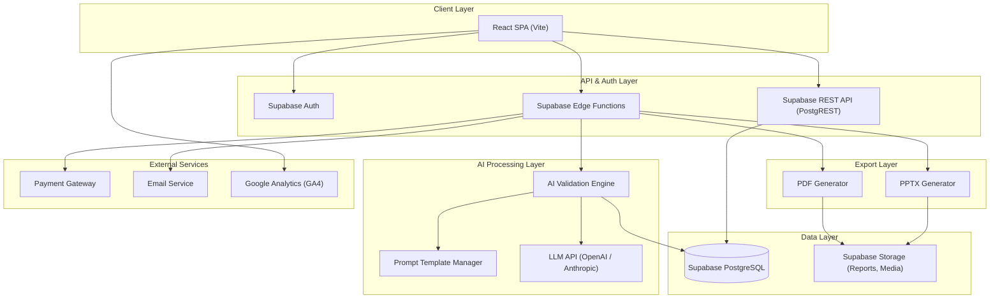
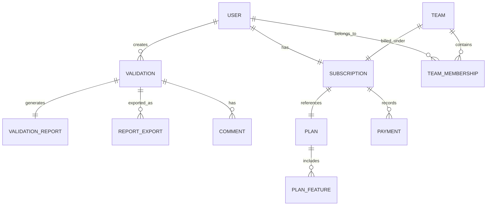

# IdeaForge — Product & Systems Documentation
## AI-Powered Business Validation Platform

> This document demonstrates **Product Development** and **System Analysis** capabilities, covering system design & decomposition (PRD + SRS), API design & contracts, and requirements engineering for IdeaForge.

---

# Part 1: System Design & Decomposition

## 1.1 Product Requirements Document (PRD)

### Product Overview

| Field | Detail |
|---|---|
| **Product** | IdeaForge — AI-Powered Business Validation |
| **Domain** | AI / Business Intelligence / SaaS |
| **Target Users** | Aspiring entrepreneurs, startup founders, business students, SMEs |
| **Platform** | Web Application (React SPA + Supabase) |
| **Business Model** | Freemium + Subscription (Monthly) |
| **AI Frameworks** | Lean Startup, SWOT Analysis, Blue Ocean Strategy |

### User Roles

| Role | Access | Description |
|---|---|---|
| **Guest** | Landing page, sample reports | Unauthenticated visitor exploring the platform |
| **Free User** | 3 total validations, basic reports | Registered user on free tier |
| **Pro User** | 50 validations/month, advanced features | Paid subscriber (Rp 99K/month) |
| **Business User** | 150 validations/month, multi-user, collaboration | Team subscription (Rp 249K/month) |
| **Admin** | System management, analytics, user management | Internal platform administrator |

---

### Module A: Business Idea Validation Engine (Core Module)

#### Problem Statement
Entrepreneurs need structured, professional-grade validation of their business ideas, but consulting is expensive (Rp 4-15M), slow (2-4 weeks), and inconsistent. There is no affordable, instant, and standardized way to get business validation in Indonesia.

#### Goals & Objectives
1. Enable users to submit a business idea through a simple form
2. Process the idea through AI using proven business frameworks
3. Generate a comprehensive, structured validation report
4. Support multiple output formats (web view, PDF, PPTX)
5. Provide consistent, framework-based analysis across all validations

#### Feature Decomposition

```
Business Validation Engine
├── Idea Input
│   ├── Business idea description (free text)
│   ├── Problem being solved
│   ├── Target market / customer segment
│   ├── Proposed solution
│   └── Industry category selection
│
├── AI Analysis Pipeline
│   ├── Market Analysis (TAM, SAM, SOM estimation)
│   ├── Competitive Landscape (direct & indirect competitors)
│   ├── SWOT Analysis (strengths, weaknesses, opportunities, threats)
│   ├── Lean Canvas generation (9 building blocks)
│   ├── MVP definition & feature prioritization
│   ├── Go-to-Market strategy & channel recommendation
│   └── Financial Planning (revenue model, costs, BEP)
│
├── Report Generation
│   ├── Structured web view with sections
│   ├── PDF export (basic & premium format)
│   ├── PowerPoint (PPTX) export (Business tier)
│   └── Report history & versioning
│
└── Validation Management
    ├── Validation history per user
    ├── Usage quota tracking (free: 3 total, Pro: 50/mo, Business: 150/mo)
    ├── Re-run validation with modified inputs
    └── Share validation report via link
```

#### User Stories

| ID | As a... | I want to... | So that... |
|---|---|---|---|
| VAL-01 | User | Input my business idea in a simple form | I can get it validated quickly |
| VAL-02 | User | Receive an AI-generated market analysis | I understand target market size and potential |
| VAL-03 | User | See a SWOT analysis of my idea | I know strengths, weaknesses, opportunities, and threats |
| VAL-04 | User | Get an auto-generated Lean Canvas | I have a one-page business plan |
| VAL-05 | User | Receive MVP recommendations | I know what to build first |
| VAL-06 | User | Get a Go-to-Market strategy | I have a plan to acquire early users |
| VAL-07 | User | See financial projections and BEP | I understand financial viability |
| VAL-08 | User | Export my report as PDF | I can share it with partners or investors |
| VAL-09 | Business User | Export reports as PowerPoint | I can use it in presentations |
| VAL-10 | User | View my validation history | I can reference past analyses |

---

### Module B: Subscription & Billing Management

#### Problem Statement
The platform needs to manage tiered access (Free, Pro, Business) with usage quotas, subscription lifecycle (start, renew, cancel), and payment processing.

#### Goals & Objectives
1. Enforce validation quotas per subscription tier
2. Manage subscription lifecycle and billing
3. Enable seamless upgrade/downgrade between tiers
4. Track usage analytics per user and organization

#### Feature Decomposition

```
Subscription & Billing
├── Tier Management
│   ├── Free tier (3 total validations, basic features)
│   ├── Pro tier (50/month, advanced AI + premium reports)
│   ├── Business tier (150/month, multi-user, collaboration, PPTX)
│   └── Feature gating per tier
│
├── Quota Management
│   ├── Track validations used vs. allowed
│   ├── Reset monthly quotas on billing date
│   ├── Display remaining validations to user
│   └── Block validation when quota exceeded
│
├── Subscription Lifecycle
│   ├── Upgrade from Free → Pro → Business
│   ├── Downgrade with feature access adjustment
│   ├── Renewal notification and auto-renewal
│   └── Cancellation with data retention
│
└── Billing
    ├── Payment processing integration
    ├── Invoice generation
    ├── Payment history
    └── Promo code / early-bird discount support
```

#### User Stories

| ID | As a... | I want to... | So that... |
|---|---|---|---|
| SUB-01 | Free User | See how many validations I have remaining | I know when to upgrade |
| SUB-02 | Free User | Upgrade to Pro plan | I get more validations and advanced features |
| SUB-03 | Pro User | View my billing history | I can track my spending |
| SUB-04 | Business User | Add team members to my subscription | My team can collaborate on validations |
| SUB-05 | User | Apply a promo code during checkout | I get a discount on my subscription |

---

### Module C: Collaboration & Team Features (Business Tier)

#### Problem Statement
Business teams need to collaborate on idea validation — sharing reports, adding comments, and managing multiple validations across team members. Solo accounts don't support multi-user workflows.

#### Goals & Objectives
1. Enable multi-user access under one Business subscription (up to 5 users)
2. Share validation reports within the team
3. Provide team-level analytics dashboard
4. Support collaborative workflows on validation reports

#### Feature Decomposition

```
Collaboration Module (Business Tier)
├── Team Management
│   ├── Invite team members via email
│   ├── Assign roles (owner, member)
│   ├── Remove team members
│   └── Team usage dashboard (validations per member)
│
├── Shared Validations
│   ├── Share validation report with team members
│   ├── View team's validation library
│   └── Search and filter shared reports
│
├── Analytics Dashboard
│   ├── Total validations by team
│   ├── Top industries/categories analyzed
│   ├── Validation trends over time
│   └── Member activity overview
│
└── Collaboration Tools
    ├── Add comments/notes to validation reports
    ├── Bookmark/favorite validations
    └── Tag validations by project or category
```

#### User Stories

| ID | As a... | I want to... | So that... |
|---|---|---|---|
| COL-01 | Business Owner | Invite team members to my subscription | My team can run validations |
| COL-02 | Team Member | View validations shared by my team | I can build on others' analyses |
| COL-03 | Business Owner | See team-level usage statistics | I know how the team uses the platform |
| COL-04 | Team Member | Add notes to a shared validation | I can provide my perspective |
| COL-05 | Business Owner | See which member ran each validation | I can track individual contributions |

---

### Module D: Admin & Content Management

#### Problem Statement
The platform needs internal tools for managing users, monitoring usage, managing the blog, and operating the lead magnet resources (free 20 business ideas).

#### Goals & Objectives
1. User management (view, deactivate, adjust tiers)
2. Platform analytics and usage monitoring
3. Content management (blog, lead magnets)
4. System configuration and prompts management

#### Feature Decomposition

```
Admin Module
├── User Management
│   ├── View all users with tier, usage, and status
│   ├── Search and filter users
│   ├── Manually adjust user tier or quota
│   └── Deactivate / suspend user accounts
│
├── Platform Analytics
│   ├── Total users, validations, and revenue
│   ├── Usage trends (daily, weekly, monthly)
│   ├── Conversion rates (Free → Pro → Business)
│   └── Churn rate and retention metrics
│
├── Content Management
│   ├── Blog post CRUD (title, body, images, SEO fields)
│   ├── Lead magnet management (business ideas list)
│   └── Sample report management
│
└── AI Configuration
    ├── Prompt template management
    ├── Framework configurations (SWOT, Lean Canvas, etc.)
    └── Output quality monitoring and tuning
```

---

## 1.2 Software Requirements Specification (SRS)

### System Architecture Overview



### Entity Relationship Summary



### Functional Requirements

#### FR-VAL: Validation Engine

| ID | Requirement | Priority |
|---|---|---|
| FR-VAL-01 | System shall accept business idea input via structured form (idea description, problem, target market, solution, industry) | Must Have |
| FR-VAL-02 | System shall process business idea through AI using Lean Startup, SWOT, and Blue Ocean frameworks | Must Have |
| FR-VAL-03 | System shall generate market analysis with TAM/SAM/SOM estimation | Must Have |
| FR-VAL-04 | System shall generate competitive landscape analysis | Must Have |
| FR-VAL-05 | System shall auto-generate a Lean Canvas (9 building blocks) | Must Have |
| FR-VAL-06 | System shall provide MVP recommendations with feature prioritization | Must Have |
| FR-VAL-07 | System shall generate Go-to-Market strategy | Should Have |
| FR-VAL-08 | System shall generate financial projections (revenue, costs, BEP) | Should Have |
| FR-VAL-09 | System shall export validation report as PDF (basic for Free, premium for Pro+) | Must Have |
| FR-VAL-10 | System shall export validation report as PowerPoint (Business tier only) | Should Have |
| FR-VAL-11 | System shall store validation history per user | Must Have |
| FR-VAL-12 | System shall allow re-running validation with modified inputs | Nice to Have |

#### FR-SUB: Subscription & Billing

| ID | Requirement | Priority |
|---|---|---|
| FR-SUB-01 | System shall enforce validation quota per tier (Free: 3 total, Pro: 50/mo, Business: 150/mo) | Must Have |
| FR-SUB-02 | System shall display remaining validation quota to user | Must Have |
| FR-SUB-03 | System shall block validation when quota is exceeded | Must Have |
| FR-SUB-04 | System shall process subscription payments via payment gateway | Must Have |
| FR-SUB-05 | System shall support upgrade from Free → Pro → Business | Must Have |
| FR-SUB-06 | System shall reset monthly quotas on billing renewal date | Must Have |
| FR-SUB-07 | System shall generate invoices for paid subscriptions | Should Have |
| FR-SUB-08 | System shall support promo codes with discount application | Should Have |

#### FR-COL: Collaboration (Business Tier)

| ID | Requirement | Priority |
|---|---|---|
| FR-COL-01 | System shall allow team owner to invite up to 5 members via email | Must Have |
| FR-COL-02 | System shall allow team members to access shared validations | Must Have |
| FR-COL-03 | System shall display team-level analytics dashboard | Should Have |
| FR-COL-04 | System shall allow users to add comments/notes on validation reports | Should Have |
| FR-COL-05 | System shall track per-member validation usage within team | Should Have |

#### FR-ADM: Admin

| ID | Requirement | Priority |
|---|---|---|
| FR-ADM-01 | System shall allow admin to view and manage all users | Must Have |
| FR-ADM-02 | System shall display platform analytics (users, validations, revenue, conversions) | Must Have |
| FR-ADM-03 | System shall allow admin to manage blog content (CRUD) | Should Have |
| FR-ADM-04 | System shall allow admin to manage AI prompt templates | Must Have |
| FR-ADM-05 | System shall allow admin to manage lead magnet content | Nice to Have |

### Non-Functional Requirements

| ID | Category | Requirement |
|---|---|---|
| NFR-01 | **Performance** | AI validation report generated within 30 seconds |
| NFR-02 | **Performance** | Non-AI API responses < 300ms for 95th percentile |
| NFR-03 | **Availability** | System uptime ≥ 99.5% |
| NFR-04 | **Scalability** | Support 500+ concurrent validation requests |
| NFR-05 | **Security** | User data and business ideas are confidential and encrypted |
| NFR-06 | **Security** | Row Level Security (RLS) — users can only access their own data |
| NFR-07 | **Security** | AI inputs are not used for model training (data privacy) |
| NFR-08 | **Usability** | Mobile-responsive web design |
| NFR-09 | **SEO** | Landing page optimized for search (SSR/meta tags) |
| NFR-10 | **Export** | PDF export < 5 seconds, PPTX export < 10 seconds |
| NFR-11 | **Localization** | Primary language: Bahasa Indonesia |
| NFR-12 | **Analytics** | Google Analytics GA4 integrated for usage tracking |

---

# Part 2: API Design & Contracts

## 2.1 API Overview

- **Base URL:** `https://api.ideaforge.id/v1` (Supabase Edge Functions)
- **Authentication:** Supabase Auth (JWT Bearer Token)
- **Content-Type:** `application/json`
- **Rate Limiting:** Per-user based on subscription tier

### Common Headers

```
Authorization: Bearer <supabase_jwt_token>
Content-Type: application/json
Accept: application/json
```

### Standard Response Envelope

```json
{
  "success": true,
  "message": "Operation completed",
  "data": { },
  "meta": {
    "current_page": 1,
    "per_page": 20,
    "total": 50
  }
}
```

### Standard Error Response

```json
{
  "success": false,
  "message": "Error description",
  "errors": {
    "field_name": ["Specific error"]
  },
  "error_code": "ERROR_CODE"
}
```

### Error Codes

| HTTP Code | Error Code | Description |
|---|---|---|
| 400 | `VALIDATION_ERROR` | Invalid input data |
| 401 | `UNAUTHORIZED` | Missing or expired JWT |
| 403 | `FORBIDDEN` | Feature not available on user's tier |
| 404 | `NOT_FOUND` | Validation or resource not found |
| 409 | `CONFLICT` | Duplicate operation (e.g., re-invite) |
| 422 | `QUOTA_EXCEEDED` | Validation quota exhausted |
| 429 | `RATE_LIMITED` | Too many requests |
| 500 | `INTERNAL_ERROR` | Server or AI processing error |
| 504 | `AI_TIMEOUT` | AI model response timed out |

---

## 2.2 Authentication APIs

### `POST /auth/register` — Register New User

**Request:**
```json
{
  "email": "entrepreneur@email.com",
  "password": "securePassword123",
  "full_name": "Rina Saputra"
}
```

**Response (201 Created):**
```json
{
  "success": true,
  "message": "Registration successful. Free plan activated with 3 validations.",
  "data": {
    "user_id": "usr_001",
    "email": "entrepreneur@email.com",
    "full_name": "Rina Saputra",
    "plan": "free",
    "validations_remaining": 3,
    "created_at": "2026-02-26T08:00:00Z"
  }
}
```

### `POST /auth/login` — Login

**Request:**
```json
{
  "email": "entrepreneur@email.com",
  "password": "securePassword123"
}
```

**Response (200 OK):**
```json
{
  "success": true,
  "data": {
    "access_token": "eyJhbGciOiJIUzI1NiIs...",
    "token_type": "Bearer",
    "expires_in": 3600,
    "user": {
      "id": "usr_001",
      "email": "entrepreneur@email.com",
      "full_name": "Rina Saputra",
      "plan": "pro",
      "validations_used": 12,
      "validations_limit": 50,
      "validations_remaining": 38
    }
  }
}
```

---

## 2.3 Validation APIs (Core)

### `POST /validations` — Submit Business Idea for Validation

**Request:**
```json
{
  "business_idea": "Platform marketplace untuk menghubungkan petani lokal dengan restoran dan hotel",
  "problem_statement": "Petani kesulitan menjual hasil panen langsung ke pembeli besar. Rantai distribusi terlalu panjang sehingga harga jual rendah dan banyak produk terbuang.",
  "target_market": "Petani sayur dan buah di Jawa Barat, restoran dan hotel bintang 3-5 di Bandung dan Jakarta",
  "proposed_solution": "Marketplace B2B yang menghubungkan petani langsung ke restoran dengan fitur pemesanan, logistik, dan pembayaran terintegrasi",
  "industry": "agriculture_tech",
  "analysis_depth": "comprehensive"
}
```

**Response (202 Accepted):**
```json
{
  "success": true,
  "message": "Validation submitted. AI analysis in progress.",
  "data": {
    "validation_id": "val_abc123",
    "status": "processing",
    "estimated_time_seconds": 25,
    "poll_url": "/validations/val_abc123/status",
    "created_at": "2026-02-26T10:00:00Z"
  }
}
```

**Error (422 Quota Exceeded):**
```json
{
  "success": false,
  "message": "Validation quota exceeded",
  "error_code": "QUOTA_EXCEEDED",
  "errors": {
    "quota": ["You have used all 3 free validations. Upgrade to Pro for 50 validations/month."]
  },
  "upgrade_url": "/pricing"
}
```

### `GET /validations/{id}/status` — Poll Validation Status

**Response (200 OK — Processing):**
```json
{
  "success": true,
  "data": {
    "validation_id": "val_abc123",
    "status": "processing",
    "progress_percent": 65,
    "current_step": "Generating financial projections..."
  }
}
```

**Response (200 OK — Completed):**
```json
{
  "success": true,
  "data": {
    "validation_id": "val_abc123",
    "status": "completed",
    "progress_percent": 100,
    "report_url": "/validations/val_abc123/report"
  }
}
```

**Error (504 AI Timeout):**
```json
{
  "success": false,
  "message": "AI analysis timed out. Please try again.",
  "error_code": "AI_TIMEOUT",
  "data": {
    "validation_id": "val_abc123",
    "status": "failed",
    "retry_url": "/validations/val_abc123/retry"
  }
}
```

### `GET /validations/{id}/report` — Get Full Validation Report

**Response (200 OK):**
```json
{
  "success": true,
  "data": {
    "validation_id": "val_abc123",
    "business_idea": "Platform marketplace petani-restoran",
    "created_at": "2026-02-26T10:00:00Z",
    "overall_score": 78,
    "overall_verdict": "Promising — Strong market potential with execution risks",

    "market_analysis": {
      "tam": {
        "value_idr": 450000000000000,
        "description": "Total pasar distribusi hasil pertanian Indonesia"
      },
      "sam": {
        "value_idr": 12000000000000,
        "description": "Pasar B2B pertanian Jawa Barat ke HoReCa"
      },
      "som": {
        "value_idr": 360000000000,
        "description": "Target realistis 3% SAM di tahun pertama"
      },
      "target_audience": "Petani sayur/buah Jawa Barat, restoran dan hotel bintang 3-5",
      "market_trend": "Growing — increasing demand for farm-to-table sourcing"
    },

    "competitive_landscape": {
      "direct_competitors": [
        {
          "name": "TaniHub",
          "strength": "Strong brand, well-funded",
          "weakness": "Focus on B2C, not specialized for HoReCa"
        }
      ],
      "indirect_competitors": [
        {
          "name": "Traditional distributors",
          "strength": "Established relationships",
          "weakness": "Inefficient, high markup, no transparency"
        }
      ],
      "competitive_advantage": "Direct petani-to-restoran connection with integrated logistics"
    },

    "swot": {
      "strengths": ["Direct connection reduces middlemen", "Technology-driven transparency"],
      "weaknesses": ["Cold-chain logistics complexity", "Farmer digital literacy gap"],
      "opportunities": ["Growing farm-to-table trend", "Government support for digital agriculture"],
      "threats": ["Established players like TaniHub", "Farmer resistance to change"]
    },

    "lean_canvas": {
      "problem": "Long distribution chain, low farmer prices, food waste",
      "customer_segments": "Farmers (suppliers), Restaurants & Hotels (buyers)",
      "unique_value_proposition": "Farm-fresh produce directly to your kitchen at fair prices",
      "solution": "B2B marketplace with logistics and payment integration",
      "channels": "Direct sales, agricultural associations, restaurant networks",
      "revenue_streams": "Transaction commission (5-8%), premium listing, logistics fee",
      "cost_structure": "Platform development, logistics partners, marketing, operations",
      "key_metrics": "GMV, active farmers, active restaurants, repeat order rate",
      "unfair_advantage": "Deep relationship with local farmer cooperatives"
    },

    "mvp_recommendation": {
      "core_features": [
        "Farmer product catalog",
        "Restaurant order placement",
        "Basic delivery coordination",
        "Payment processing"
      ],
      "development_timeline": "8-12 weeks",
      "estimated_cost_idr": 150000000,
      "launch_strategy": "Pilot with 20 farmers and 10 restaurants in Bandung"
    },

    "go_to_market": {
      "phase_1": "Pilot in Bandung with direct farmer and restaurant onboarding",
      "phase_2": "Expand to Jakarta HoReCa market",
      "phase_3": "Scale across Java with logistics partnerships",
      "acquisition_channels": ["Direct B2B sales", "Agricultural cooperatives", "Restaurant associations"]
    },

    "financial_projections": {
      "monthly_revenue_year_1": 45000000,
      "monthly_costs_year_1": 38000000,
      "break_even_month": 8,
      "revenue_model": "Commission per transaction (5-8%) + logistics markup",
      "assumptions": "100 active farmers, 50 active restaurants, avg order Rp 2M/month"
    }
  }
}
```

### `GET /validations` — List User's Validation History

**Query Parameters:** `page`, `per_page`, `sort` (`created_at`, `score`), `industry`

**Response (200 OK):**
```json
{
  "success": true,
  "data": [
    {
      "validation_id": "val_abc123",
      "business_idea": "Platform marketplace petani-restoran",
      "industry": "agriculture_tech",
      "overall_score": 78,
      "overall_verdict": "Promising",
      "status": "completed",
      "created_at": "2026-02-26T10:00:00Z"
    },
    {
      "validation_id": "val_def456",
      "business_idea": "Subscription box makanan sehat",
      "industry": "food_beverage",
      "overall_score": 65,
      "overall_verdict": "Viable with adjustments",
      "status": "completed",
      "created_at": "2026-02-20T14:30:00Z"
    }
  ],
  "meta": { "current_page": 1, "per_page": 20, "total": 12 }
}
```

---

## 2.4 Export APIs

### `POST /validations/{id}/export` — Export Validation Report

**Request:**
```json
{
  "format": "pdf",
  "template": "premium",
  "include_sections": ["market_analysis", "swot", "lean_canvas", "mvp_recommendation", "financial_projections"]
}
```

**Response (202 Accepted):**
```json
{
  "success": true,
  "message": "Report export queued",
  "data": {
    "export_id": "exp_001",
    "format": "pdf",
    "status": "generating",
    "estimated_time_seconds": 5,
    "poll_url": "/exports/exp_001/status"
  }
}
```

**Response (200 OK — Ready):**
```json
{
  "success": true,
  "data": {
    "export_id": "exp_001",
    "format": "pdf",
    "status": "ready",
    "download_url": "https://storage.ideaforge.id/exports/val_abc123_report.pdf",
    "expires_at": "2026-02-27T10:00:00Z",
    "file_size_bytes": 245760
  }
}
```

**Error (403 Forbidden — Tier restriction):**
```json
{
  "success": false,
  "message": "PowerPoint export is only available on the Business plan",
  "error_code": "FORBIDDEN",
  "errors": {
    "format": ["PPTX export requires Business plan. Your current plan: Pro."]
  },
  "upgrade_url": "/pricing"
}
```

---

## 2.5 Subscription APIs

### `POST /subscriptions/upgrade` — Upgrade Subscription

**Request:**
```json
{
  "plan": "pro",
  "billing_cycle": "monthly",
  "promo_code": "EARLYBIRD50"
}
```

**Response (200 OK):**
```json
{
  "success": true,
  "message": "Subscription upgraded to Pro plan",
  "data": {
    "subscription_id": "sub_001",
    "plan": "pro",
    "price_idr": 49000,
    "original_price_idr": 99000,
    "discount_applied": "EARLYBIRD50 (50% off)",
    "billing_cycle": "monthly",
    "validations_limit": 50,
    "validations_remaining": 50,
    "next_billing_date": "2026-03-26",
    "activated_at": "2026-02-26T10:00:00Z"
  }
}
```

### `GET /subscriptions/usage` — Get Usage Statistics

**Response (200 OK):**
```json
{
  "success": true,
  "data": {
    "plan": "pro",
    "billing_period": {
      "start": "2026-02-26",
      "end": "2026-03-25"
    },
    "validations": {
      "used": 12,
      "limit": 50,
      "remaining": 38,
      "usage_percent": 24
    },
    "exports": {
      "pdf_generated": 8,
      "pptx_generated": 0
    },
    "days_remaining": 27
  }
}
```

---

## 2.6 Collaboration APIs (Business Tier)

### `POST /teams/members` — Invite Team Member

**Request:**
```json
{
  "email": "colleague@startup.com",
  "role": "member"
}
```

**Response (201 Created):**
```json
{
  "success": true,
  "message": "Invitation sent to colleague@startup.com",
  "data": {
    "invitation_id": "inv_001",
    "email": "colleague@startup.com",
    "role": "member",
    "status": "pending",
    "invited_at": "2026-02-26T10:00:00Z"
  }
}
```

**Error (422 Business Rule Violation):**
```json
{
  "success": false,
  "message": "Team member limit reached",
  "error_code": "QUOTA_EXCEEDED",
  "errors": {
    "members": ["Business plan allows up to 5 team members. You currently have 5."]
  }
}
```

### `GET /teams/validations` — List Team Validations

**Response (200 OK):**
```json
{
  "success": true,
  "data": [
    {
      "validation_id": "val_abc123",
      "business_idea": "Platform marketplace petani-restoran",
      "created_by": {
        "id": "usr_001",
        "name": "Rina Saputra"
      },
      "overall_score": 78,
      "shared": true,
      "comments_count": 3,
      "created_at": "2026-02-26T10:00:00Z"
    }
  ]
}
```

---

# Part 3: Requirements Engineering

## 3.1 Validation Engine — Requirements & Acceptance Criteria

### REQ-VAL-01: Business Idea Input

| Field | Detail |
|---|---|
| **Requirement** | User can submit a business idea through a structured input form |
| **Priority** | Must Have |
| **Dependency** | User authentication |

**Acceptance Criteria:**
- [ ] AC-01: Form includes fields: business idea description, problem statement, target market, proposed solution, and industry selector
- [ ] AC-02: All fields are required; system shows inline validation errors
- [ ] AC-03: Business idea description supports minimum 50 characters and maximum 2000 characters
- [ ] AC-04: Industry selector includes predefined categories (tech, F&B, agriculture, education, health, etc.)
- [ ] AC-05: System checks user's remaining quota before accepting submission

---

### REQ-VAL-02: AI-Powered Analysis

| Field | Detail |
|---|---|
| **Requirement** | System processes the idea through AI using multiple business frameworks |
| **Priority** | Must Have |
| **Dependency** | REQ-VAL-01, LLM API integration |

**Acceptance Criteria:**
- [ ] AC-01: AI generates market analysis with TAM, SAM, and SOM estimations
- [ ] AC-02: AI generates competitive landscape with direct and indirect competitors
- [ ] AC-03: AI generates complete SWOT analysis (strengths, weaknesses, opportunities, threats)
- [ ] AC-04: AI generates Lean Canvas with all 9 building blocks populated
- [ ] AC-05: AI generates MVP recommendations with core features and timeline
- [ ] AC-06: AI generates Go-to-Market strategy (Pro tier and above)
- [ ] AC-07: AI generates financial projections with revenue model and BEP (Pro tier and above)
- [ ] AC-08: Analysis completes within 30 seconds for 95th percentile
- [ ] AC-09: If AI times out, system returns error with retry option

---

### REQ-VAL-03: Validation Report Display

| Field | Detail |
|---|---|
| **Requirement** | User can view the complete validation report in a structured web view |
| **Priority** | Must Have |
| **Dependency** | REQ-VAL-02 |

**Acceptance Criteria:**
- [ ] AC-01: Report displays overall score (0-100) and verdict
- [ ] AC-02: Report is organized into collapsible sections (market, SWOT, lean canvas, MVP, etc.)
- [ ] AC-03: Free users see all sections but with basic depth
- [ ] AC-04: Pro/Business users see advanced competitor analysis and financial projections
- [ ] AC-05: Report is responsive and readable on mobile devices

---

### REQ-VAL-04: Report Export (PDF & PPTX)

| Field | Detail |
|---|---|
| **Requirement** | User can export validation reports in PDF and PowerPoint formats |
| **Priority** | Must Have |
| **Dependency** | REQ-VAL-03 |

**Acceptance Criteria:**
- [ ] AC-01: Free users can export basic PDF reports
- [ ] AC-02: Pro users can export premium PDF reports with full sections and branding
- [ ] AC-03: Business users can export as both PDF and PowerPoint (PPTX)
- [ ] AC-04: PDF export completes within 5 seconds
- [ ] AC-05: PPTX export completes within 10 seconds
- [ ] AC-06: Exported files include IdeaForge branding and generation date
- [ ] AC-07: Download link is valid for 24 hours after generation

---

### REQ-VAL-05: Validation History

| Field | Detail |
|---|---|
| **Requirement** | User can view and manage their past validations |
| **Priority** | Must Have |
| **Dependency** | REQ-VAL-02 |

**Acceptance Criteria:**
- [ ] AC-01: User can see a list of all past validations with idea title, score, and date
- [ ] AC-02: List supports pagination (20 items per page)
- [ ] AC-03: User can click on a validation to view the full report
- [ ] AC-04: User can sort by date or score
- [ ] AC-05: User can filter by industry category

---

## 3.2 Subscription & Billing — Requirements & Acceptance Criteria

### REQ-SUB-01: Quota Enforcement

| Field | Detail |
|---|---|
| **Requirement** | System enforces validation quotas based on subscription tier |
| **Priority** | Must Have |
| **Dependency** | User authentication, subscription records |

**Acceptance Criteria:**
- [ ] AC-01: Free users are limited to 3 total validations (lifetime, not monthly)
- [ ] AC-02: Pro users are limited to 50 validations per billing month
- [ ] AC-03: Business users are limited to 150 validations per billing month (shared across team)
- [ ] AC-04: System displays remaining quota prominently before each validation
- [ ] AC-05: System blocks new validations when quota is exhausted with upgrade prompt
- [ ] AC-06: Monthly quotas reset at midnight on the billing renewal date

---

### REQ-SUB-02: Plan Upgrade & Payment

| Field | Detail |
|---|---|
| **Requirement** | User can upgrade subscription and process payments |
| **Priority** | Must Have |
| **Dependency** | Payment gateway integration |

**Acceptance Criteria:**
- [ ] AC-01: User can upgrade from Free → Pro or Free → Business from the pricing page
- [ ] AC-02: Promo codes are validated and discount applied before checkout
- [ ] AC-03: Payment is processed securely via payment gateway
- [ ] AC-04: Upon successful payment, tier is immediately upgraded and quota activated
- [ ] AC-05: User receives confirmation email with invoice
- [ ] AC-06: Failed payments show clear error messages and retry option

---

### REQ-SUB-03: Subscription Lifecycle Management

| Field | Detail |
|---|---|
| **Requirement** | System manages renewals, downgrades, and cancellations |
| **Priority** | Should Have |
| **Dependency** | REQ-SUB-02 |

**Acceptance Criteria:**
- [ ] AC-01: Subscriptions auto-renew monthly unless cancelled
- [ ] AC-02: User receives renewal reminder email 3 days before billing date
- [ ] AC-03: User can cancel subscription; access continues until end of billing period
- [ ] AC-04: Downgrade to Free retains validation history but limits future validations
- [ ] AC-05: Payment history is viewable with invoice download links

---

## 3.3 Collaboration — Requirements & Acceptance Criteria

### REQ-COL-01: Team Management

| Field | Detail |
|---|---|
| **Requirement** | Business plan owner can manage team members |
| **Priority** | Must Have (for Business tier) |
| **Dependency** | Business subscription active |

**Acceptance Criteria:**
- [ ] AC-01: Owner can invite team members via email (max 5 members total including owner)
- [ ] AC-02: Invited users receive email with join link
- [ ] AC-03: Invited users who don't have accounts are prompted to register
- [ ] AC-04: Owner can remove team members; removed members lose access to shared validations
- [ ] AC-05: Team validations count against the shared team quota (150/month)

---

### REQ-COL-02: Shared Validations & Comments

| Field | Detail |
|---|---|
| **Requirement** | Team members can share and collaborate on validation reports |
| **Priority** | Should Have |
| **Dependency** | REQ-COL-01 |

**Acceptance Criteria:**
- [ ] AC-01: Team members can view all validations created by any team member
- [ ] AC-02: Users can add text comments on validation reports
- [ ] AC-03: Comments display author name and timestamp
- [ ] AC-04: Users can bookmark/favorite validations for quick access
- [ ] AC-05: Validations can be tagged by project or category for organization

---

## 3.4 Admin — Requirements & Acceptance Criteria

### REQ-ADM-01: User & Platform Management

| Field | Detail |
|---|---|
| **Requirement** | Admin can manage users and monitor platform health |
| **Priority** | Must Have |
| **Dependency** | Admin role authentication |

**Acceptance Criteria:**
- [ ] AC-01: Admin can view all users with plan, usage, registration date, and status
- [ ] AC-02: Admin can search users by email or name
- [ ] AC-03: Admin can manually adjust user tier or quota (e.g., for partners or testing)
- [ ] AC-04: Admin can deactivate user accounts
- [ ] AC-05: Admin dashboard shows total users, validations, revenue, and conversion rates

---

### REQ-ADM-02: AI Prompt Management

| Field | Detail |
|---|---|
| **Requirement** | Admin can manage and tune AI prompt templates |
| **Priority** | Must Have |
| **Dependency** | AI Engine integration |

**Acceptance Criteria:**
- [ ] AC-01: Admin can view and edit prompt templates for each analysis section
- [ ] AC-02: Admin can create new prompt versions without deleting old ones
- [ ] AC-03: Admin can set the active prompt version per analysis section
- [ ] AC-04: System logs which prompt version was used for each validation (for quality tracking)
- [ ] AC-05: Admin can test a prompt template with sample inputs before activating

---

## Summary Matrix

| Module | Requirements | User Stories | API Endpoints | Acceptance Criteria |
|---|:---:|:---:|:---:|:---:|
| **Validation Engine** | 5 | 10 | 5 | 26 |
| **Subscription & Billing** | 3 | 5 | 3 | 17 |
| **Collaboration** | 2 | 5 | 2 | 10 |
| **Admin** | 2 | — | — | 10 |
| **Auth** | — | — | 2 | — |
| **Export** | — | — | 1 | — |
| **Total** | **12** | **20** | **13** | **63** |
